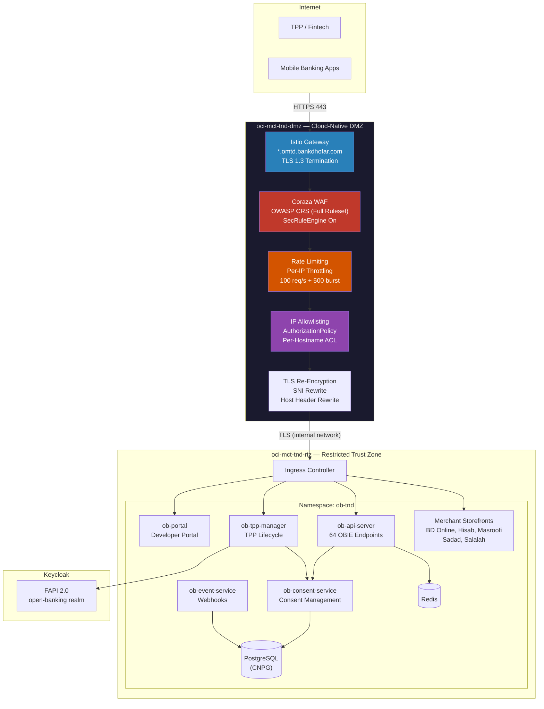
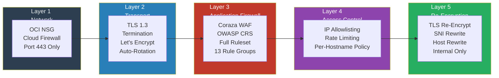

# Qantara — قنطرة

**Bank Dhofar Open Banking Platform**

Qantara (قنطرة — Bridge) provides OBIE v4.0 compliant APIs to third-party providers (TPPs), enabling fintechs to access account information, initiate payments, and manage recurring payments through Bank Dhofar's infrastructure.

## Architecture Overview



## Cloud-Native DMZ — Zero Trust Security Architecture

The DMZ cluster (`oci-mct-tnd-dmz`) is a **purpose-built, fully isolated Kubernetes cluster** that serves as the sole internet-facing entry point for all Bank Dhofar digital banking services. It implements a contemporary, cloud-native approach to perimeter security that replaces traditional appliance-based WAF/DMZ with a programmable, policy-driven, infrastructure-as-code security boundary.

### Design Principles

- **Complete Network Isolation** — The DMZ cluster runs on a dedicated OCI VCN with no direct network path to application workloads. Traffic is re-encrypted and forwarded through controlled internal endpoints only.
- **Zero Trust by Default** — `outboundTrafficPolicy: REGISTRY_ONLY` ensures the DMZ mesh cannot reach any upstream service unless explicitly registered via ServiceEntry. There is no implicit connectivity.
- **Defense in Depth** — Every request passes through five independent security layers before reaching the application tier (see below).
- **Infrastructure as Code** — The entire DMZ stack is defined declaratively (Crossplane + ArgoCD), versioned in Git, and continuously reconciled. No manual configuration, no drift.
- **Immutable Infrastructure** — No SSH access, no runtime patching. All changes flow through Git commit → CI pipeline → ArgoCD sync.

### Security Layers (Defense in Depth)



### OWASP Top 10 Coverage (Coraza WAF + OWASP CRS)

The Coraza Web Application Firewall runs as a **Wasm plugin** directly inside the Istio Envoy proxy at the ingress gateway. It loads the complete OWASP Core Rule Set (CRS), providing real-time request inspection and blocking against all OWASP Top 10 threat categories:

| OWASP Top 10 | CRS Rule Groups | Protection |
|---|---|---|
| **A01 Broken Access Control** | REQUEST-911-METHOD-ENFORCEMENT, REQUEST-930-LFI | HTTP method restriction, path traversal blocking |
| **A02 Cryptographic Failures** | TLS 1.3 enforcement at gateway | Encrypted in transit, no plaintext fallback |
| **A03 Injection** | REQUEST-932-RCE, REQUEST-941-XSS, REQUEST-942-SQLI, REQUEST-933-PHP, REQUEST-934-GENERIC, REQUEST-944-JAVA | SQL injection, XSS, command injection, code injection |
| **A04 Insecure Design** | FAPI 2.0 + consent-scoped tokens | OAuth2+PKCE, per-resource consent validation |
| **A05 Security Misconfiguration** | REQUEST-920-PROTOCOL-ENFORCEMENT, SecRequestBodyLimit | Protocol validation, body size limits, header checks |
| **A06 Vulnerable Components** | Immutable images, Harbor registry scanning | CI-built images only, no runtime modification |
| **A07 Authentication Failures** | REQUEST-913-SCANNER-DETECTION, REQUEST-943-SESSION-FIXATION | Scanner blocking, session fixation prevention |
| **A08 Data Integrity Failures** | GitOps pipeline (Git → CI → ArgoCD) | Signed commits, immutable artifacts, no manual deploys |
| **A09 Logging & Monitoring** | SecAuditEngine → Vector → OpenSearch | Every WAF-triggered event logged, searchable, alertable |
| **A10 SSRF** | REQUEST-931-RFI, REGISTRY_ONLY outbound | Remote file inclusion blocking, outbound traffic lockdown |

### DMZ Security Controls (Detailed)

| Control | Technology | Implementation Detail |
|---------|-----------|----------------------|
| **Web Application Firewall** | Coraza WasmPlugin v0.6.0 | Runs in-process inside Envoy — zero network hop. Full OWASP CRS loaded via `@owasp_crs/*.conf`. `SecRuleEngine On` (enforcing, not detect-only). Request body inspection enabled. |
| **TLS Termination** | Istio Gateway + cert-manager | Wildcard `*.omtd.bankdhofar.com` certificate. Let's Encrypt ACME with auto-renewal. TLS 1.3 enforced. |
| **TLS Re-Encryption** | Istio DestinationRule | Traffic re-encrypted before leaving DMZ. SNI rewrite ensures TND ingress routes correctly. No plaintext on the wire between clusters. |
| **IP Allowlisting** | Istio AuthorizationPolicy | DENY action with `notIpBlocks` per hostname. Only whitelisted source CIDRs reach each service. Per-app granularity. |
| **Rate Limiting** | Envoy Local Rate Limit | 100 requests/second per source IP, 500 token burst. Applied per virtual host. Prevents volumetric abuse. |
| **Outbound Lockdown** | Istio `REGISTRY_ONLY` | No implicit outbound connectivity. Every upstream must be explicitly registered as a ServiceEntry. Prevents data exfiltration and C2 callbacks. |
| **HTTP Strict Transport** | HTTPRoute redirect | All HTTP/80 requests receive 301 redirect to HTTPS. No plaintext API access possible. |
| **Request Size Limiting** | Coraza `SecRequestBodyLimit` | 12.5 MB maximum request body. Prevents oversized payload abuse. |
| **Audit Logging** | Coraza → stdout → Vector → OpenSearch | All WAF-triggered events (blocks, anomalies, rule matches) streamed in real-time to centralized OpenSearch for SIEM integration. |

### DMZ vs Traditional WAF Comparison

| Capability | Traditional Appliance WAF | Qantara Cloud-Native DMZ |
|---|---|---|
| Deployment | Physical/virtual appliance, manual config | Kubernetes-native, declarative YAML, GitOps |
| Scaling | Vertical (buy bigger box) | Horizontal (HPA auto-scaling, 1-N replicas) |
| Rule updates | Manual vendor patches, change windows | Git commit → ArgoCD sync, OWASP CRS auto-update |
| Configuration drift | Common, hard to detect | Impossible — ArgoCD continuously reconciles |
| Observability | Vendor-specific dashboard | OpenSearch + Vector pipeline, standard log format |
| Multi-tenancy | Shared appliance, blast radius = all apps | Per-hostname policies, per-app rate limits |
| TLS management | Manual cert rotation, outage risk | cert-manager auto-renewal, zero-downtime |
| Infrastructure as Code | Rarely | 100% — every resource is a versioned Git artifact |
| Disaster Recovery | Active-passive, manual failover | Redeploy from Git in minutes to any cluster |
| Cost | CapEx licensing + support contracts | Open source (Coraza, Istio, CRS), OpEx only |
| Vendor Lock-in | High (F5, Imperva, etc.) | None — CNCF-standard components |

## Services

| Service | Stack | Purpose |
|---------|-------|---------|
| **ob-api-server** | Python/FastAPI | 64 OBIE v4.0 endpoints with pluggable adapter pattern |
| **ob-consent-service** | Python/FastAPI | Consent lifecycle, validation, audit trail |
| **ob-tpp-manager** | Go | TPP registration, Keycloak client provisioning |
| **ob-event-service** | Python/FastAPI | Event subscriptions, webhook delivery |
| **ob-portal** | React 18/Mantine | Qantara developer portal — API catalog, sandbox, apps |
| **ob-sandbox-app** | Expo/React Native | Mock banking app for consent flow testing |
| **bd-online** | React | BD Online Banking mock storefront |
| **hisab** | React | Hisab merchant mock storefront |
| **masroofi** | React | Masroofi merchant mock storefront |
| **sadad** | React | Sadad merchant mock storefront |
| **salalah-el** | React | Salalah Electronics merchant mock storefront |

## OBIE API Coverage (64 Endpoints)

| Specification | Endpoints | Prefix |
|---|---|---|
| Account Information (AIS) | 23 | `/open-banking/v4.0/aisp/` |
| Payment Initiation (PIS) | 18 | `/open-banking/v4.0/pisp/` |
| Confirmation of Funds (CoF) | 4 | `/open-banking/v4.0/cbpii/` |
| Variable Recurring Payments (VRP) | 6 | `/open-banking/v4.0/pisp/` |
| Event Notifications | 7 | `/open-banking/v4.0/events/` |
| Event Subscriptions | 6 | `/open-banking/v4.0/events/` |

## Deployment

| Layer | Resource |
|-------|----------|
| **DMZ Cluster** | `oci-mct-tnd-dmz` — internet-facing, zero-trust DMZ |
| **TND Cluster** | `oci-mct-tnd-rtz` — application workloads |
| **Namespace** | `ob-tnd` |
| **Public domain** | `*.omtd.bankdhofar.com` (via DMZ) |
| **Internal domain** | `*.tnd.bankdhofar.com` (TND direct) |
| **Auth** | Keycloak FAPI 2.0 (`open-banking` realm) |
| **Database** | PostgreSQL (CNPG) |
| **Cache** | Redis |
| **Registry** | `harbor.cp.bankdhofar.com/qantara/` |

### Public Endpoints (via DMZ)

| Public URL | Host Rewrite | Backend |
|---|---|---|
| `banking-api.omtd.bankdhofar.com` | `banking.tnd.bankdhofar.com` | bd-online |
| `hisab-api.omtd.bankdhofar.com` | `hisab.tnd.bankdhofar.com` | hisab |
| `masroofi-api.omtd.bankdhofar.com` | `masroofi.tnd.bankdhofar.com` | masroofi |
| `sadad-api.omtd.bankdhofar.com` | `sadad.tnd.bankdhofar.com` | sadad |
| `salalah-api.omtd.bankdhofar.com` | `salalah.tnd.bankdhofar.com` | salalah-el |
| `qantara-api.omtd.bankdhofar.com` | `qantara.tnd.bankdhofar.com` | qantara platform |
| `mosambee.omtd.bankdhofar.com` | `mosambee.sit.bankdhofar.com` | mosambee POS |

## Adapter Strategy

All endpoints use a pluggable adapter pattern. Backend adapters are swapped per-endpoint without API changes:

| Adapter | Backend | Status |
|---------|---------|--------|
| MockAdapter | Synthetic OBIE data | Active |
| CorporateAdapter | Bank Dhofar Corporate Banking APIs | Phase 2 |
| EMandateAdapter | Bank Dhofar E-Mandate APIs | Phase 2 |

## Documentation

- [High-Level Design](docs/HLD.md)
- [Fintech Developer Journey](docs/developer-journey.md)
- [Transport Security — mTLS and TLS Architecture](docs/transport-security.md)
- [OBIE Coverage Analysis](api-catalog/docs/obie-coverage-analysis.md)
- [Consent Service Design](api-catalog/docs/consent-service-design.md)
- [API Mapping (BD → OBIE)](api-catalog/docs/api-mapping-obie.md)
- [Keycloak FAPI Realm](keycloak/open-banking-realm.json)

## Repository Structure

```
open-banking/
├── services/
│   ├── ob-api-server/        # OBIE API server (FastAPI)
│   ├── ob-consent-service/   # Consent management (FastAPI)
│   ├── ob-tpp-manager/       # TPP lifecycle (Go)
│   ├── ob-event-service/     # Event webhooks (FastAPI)
│   ├── ob-portal/            # Developer portal (React)
│   ├── ob-sandbox-app/       # Mock banking app (Expo)
│   ├── bd-online-mobile/     # BD Online Banking mobile (Expo)
│   ├── hisab-mobile/         # Hisab merchant mobile (Expo)
│   ├── masroofi-mobile/      # Masroofi merchant mobile (Expo)
│   ├── sadad-mobile/         # Sadad merchant mobile (Expo)
│   ├── salalah-mobile/       # Salalah Electronics mobile (Expo)
│   └── dealer-sdk/           # Shared merchant SDK
├── helm/                     # Helm chart for K8s deployment
├── keycloak/                 # FAPI 2.0 realm configuration
├── api-catalog/              # OBIE specs and analysis docs
├── obie-specs/               # OBIE OpenAPI specifications
├── docs/                     # Architecture documentation
└── .gitlab-ci.yml            # CI/CD pipeline
```

## Related Repositories

| Repo | Purpose |
|------|---------|
| `devops/infra` | DMZ overlay, Istio routing, Coraza WAF config (`overlays/oci-bankdhofar-muscat-dmz/`) |
| `devops/crossplane/platform` | Crossplane CRs for DMZ cluster cloud resources |
| `ea/open-banking` | This repo — application code + Helm chart |
