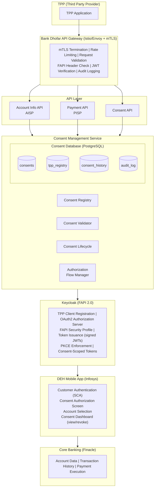
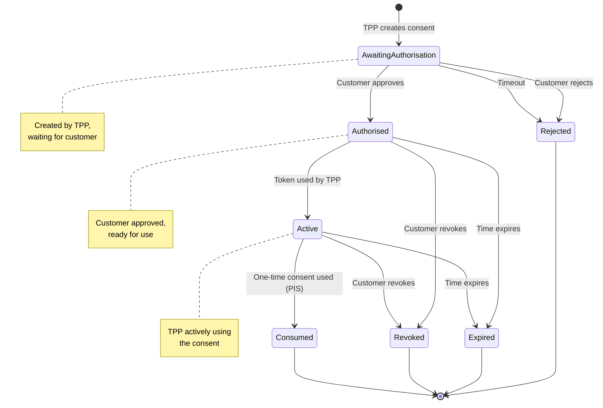
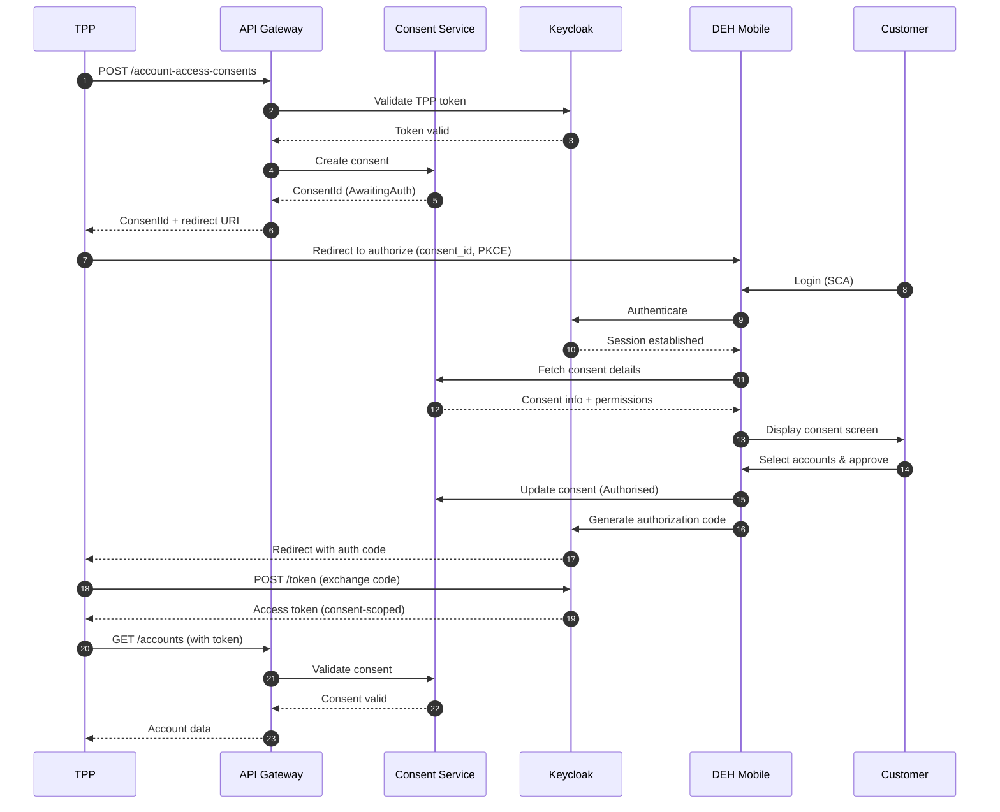
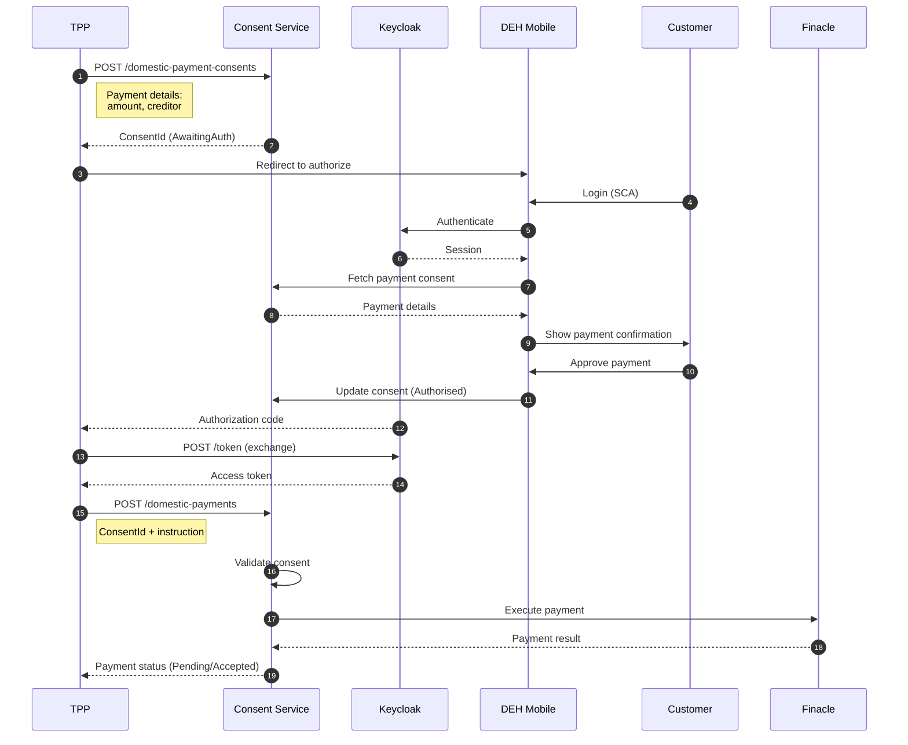
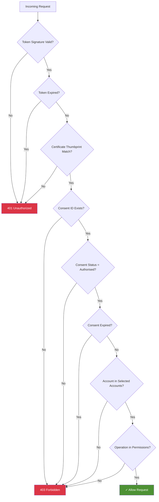
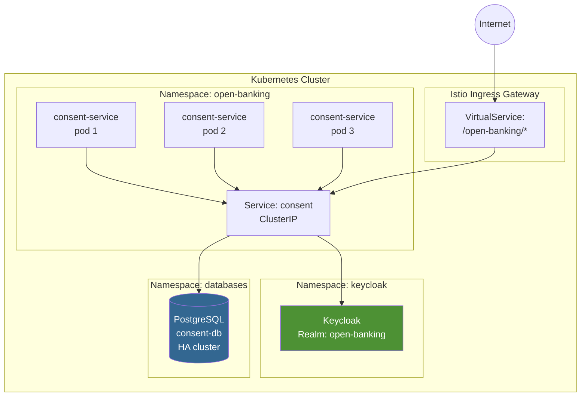

# Bank Dhofar Open Banking Consent Service - Technical Design

## Document Information

| Item | Value |
|------|-------|
| Version | 1.0 |
| Date | January 2026 |
| Status | Draft |
| Classification | Internal |

---

## 1. Executive Summary

This document provides the technical design for Bank Dhofar's Open Banking Consent Management Service, enabling third-party providers (TPPs) to access customer account data and initiate payments with explicit customer consent, in compliance with CBO Open Banking Framework.

---

## 2. Architecture Overview

### 2.1 High-Level Architecture



### 2.2 Component Responsibilities

| Component | Technology | Responsibility |
|-----------|------------|----------------|
| API Gateway | Istio/Envoy | mTLS, routing, rate limiting, FAPI header validation |
| Consent Service | Spring Boot / Go | Consent CRUD, lifecycle management, validation |
| Consent Database | PostgreSQL | Consent storage, history, audit trail |
| Keycloak | Keycloak 24+ | OAuth2/OIDC, FAPI 2.0, token issuance |
| DEH Mobile | Infosys DEH | Customer-facing consent authorization |
| Core Banking | Finacle | Account data, payment execution |

---

## 3. Consent Lifecycle

### 3.1 Consent States



### 3.2 Consent Types

| Consent Type | OBIE Endpoint | Description | Default Expiry |
|--------------|---------------|-------------|----------------|
| Account Access | `/account-access-consents` | Read accounts, balances, transactions | 180 days |
| Payment | `/domestic-payment-consents` | Single immediate payment | One-time use |
| Scheduled Payment | `/domestic-scheduled-payment-consents` | Future-dated payment | Until execution |
| Standing Order | `/domestic-standing-order-consents` | Recurring payment | Until end date |
| VRP | `/domestic-vrp-consents` | Variable recurring payment | As specified |
| Funds Confirmation | `/funds-confirmation-consents` | Balance check capability | 180 days |

---

## 4. Authorization Flow

### 4.1 Account Information Service (AIS) Flow



### 4.2 Payment Initiation Service (PIS) Flow



---

## 5. Data Model

### 5.1 Consent Entity

```sql
CREATE TABLE consents (
    consent_id          UUID PRIMARY KEY DEFAULT gen_random_uuid(),
    consent_type        VARCHAR(50) NOT NULL,  -- AIS, PIS, VRP, CoF
    tpp_id              VARCHAR(100) NOT NULL,
    customer_id         VARCHAR(100),          -- NULL until authorized

    -- Consent details (JSON for flexibility)
    permissions         JSONB NOT NULL,        -- ["ReadAccountsBasic", "ReadBalances", ...]
    selected_accounts   JSONB,                 -- Account IDs selected by customer

    -- Payment-specific (for PIS consents)
    payment_details     JSONB,                 -- Amount, creditor, reference, etc.

    -- Lifecycle
    status              VARCHAR(20) NOT NULL DEFAULT 'AwaitingAuthorisation',
    status_update_time  TIMESTAMP WITH TIME ZONE DEFAULT NOW(),
    creation_time       TIMESTAMP WITH TIME ZONE DEFAULT NOW(),
    expiration_time     TIMESTAMP WITH TIME ZONE,

    -- Timestamps
    authorization_time  TIMESTAMP WITH TIME ZONE,
    revocation_time     TIMESTAMP WITH TIME ZONE,
    revocation_reason   VARCHAR(255),

    -- Metadata
    risk_data           JSONB,                 -- x-fapi headers, IP, device info

    CONSTRAINT valid_status CHECK (status IN (
        'AwaitingAuthorisation', 'Authorised', 'Rejected',
        'Consumed', 'Revoked', 'Expired'
    ))
);

CREATE INDEX idx_consents_tpp ON consents(tpp_id);
CREATE INDEX idx_consents_customer ON consents(customer_id);
CREATE INDEX idx_consents_status ON consents(status);
CREATE INDEX idx_consents_expiration ON consents(expiration_time) WHERE status = 'Authorised';
```

### 5.2 Consent History (Audit Trail)

```sql
CREATE TABLE consent_history (
    id                  BIGSERIAL PRIMARY KEY,
    consent_id          UUID NOT NULL REFERENCES consents(consent_id),
    event_type          VARCHAR(50) NOT NULL,   -- CREATED, AUTHORIZED, REVOKED, ACCESSED, etc.
    event_time          TIMESTAMP WITH TIME ZONE DEFAULT NOW(),
    actor_type          VARCHAR(20) NOT NULL,   -- TPP, CUSTOMER, SYSTEM
    actor_id            VARCHAR(100),
    previous_status     VARCHAR(20),
    new_status          VARCHAR(20),
    details             JSONB,                  -- Additional context
    ip_address          INET,
    user_agent          TEXT
);

CREATE INDEX idx_consent_history_consent ON consent_history(consent_id);
CREATE INDEX idx_consent_history_time ON consent_history(event_time);
```

### 5.3 TPP Registry

```sql
CREATE TABLE tpp_registry (
    tpp_id              VARCHAR(100) PRIMARY KEY,
    tpp_name            VARCHAR(255) NOT NULL,
    tpp_name_ar         VARCHAR(255),           -- Arabic name
    registration_number VARCHAR(100),           -- CBO registration

    -- Roles (from CBO license)
    is_aisp             BOOLEAN DEFAULT FALSE,
    is_pisp             BOOLEAN DEFAULT FALSE,
    is_cisp             BOOLEAN DEFAULT FALSE,  -- Card issuer

    -- Client configuration
    client_id           VARCHAR(100) UNIQUE NOT NULL,
    redirect_uris       TEXT[] NOT NULL,
    jwks_uri            TEXT,
    software_statement  TEXT,

    -- Status
    status              VARCHAR(20) NOT NULL DEFAULT 'Active',
    onboarded_at        TIMESTAMP WITH TIME ZONE DEFAULT NOW(),

    CONSTRAINT valid_tpp_status CHECK (status IN ('Active', 'Suspended', 'Revoked'))
);
```

---

## 6. API Specification

### 6.1 Consent API Endpoints

| Method | Endpoint | Description | Auth |
|--------|----------|-------------|------|
| POST | `/account-access-consents` | Create AIS consent | TPP Client Credentials |
| GET | `/account-access-consents/{ConsentId}` | Get consent status | TPP Client Credentials |
| DELETE | `/account-access-consents/{ConsentId}` | Revoke consent | TPP Client Credentials |
| POST | `/domestic-payment-consents` | Create payment consent | TPP Client Credentials |
| GET | `/domestic-payment-consents/{ConsentId}` | Get payment consent | TPP Client Credentials |
| GET | `/domestic-payment-consents/{ConsentId}/funds-confirmation` | Check funds | PSU Access Token |

### 6.2 Request/Response Examples

#### Create Account Access Consent

**Request:**
```http
POST /open-banking/v4.0/aisp/account-access-consents HTTP/1.1
Host: api.bankdhofar.com
Authorization: Bearer <tpp_access_token>
x-fapi-interaction-id: 93bac548-d2de-4546-b106-880a5018460d
Content-Type: application/json

{
  "Data": {
    "Permissions": [
      "ReadAccountsBasic",
      "ReadAccountsDetail",
      "ReadBalances",
      "ReadTransactionsBasic",
      "ReadTransactionsDetail",
      "ReadBeneficiariesBasic"
    ],
    "ExpirationDateTime": "2026-07-22T00:00:00+04:00",
    "TransactionFromDateTime": "2025-01-22T00:00:00+04:00",
    "TransactionToDateTime": "2026-07-22T00:00:00+04:00"
  },
  "Risk": {}
}
```

**Response:**
```http
HTTP/1.1 201 Created
x-fapi-interaction-id: 93bac548-d2de-4546-b106-880a5018460d

{
  "Data": {
    "ConsentId": "aac-1234-5678-90ab",
    "Status": "AwaitingAuthorisation",
    "StatusUpdateDateTime": "2026-01-22T10:00:00+04:00",
    "CreationDateTime": "2026-01-22T10:00:00+04:00",
    "Permissions": [
      "ReadAccountsBasic",
      "ReadAccountsDetail",
      "ReadBalances",
      "ReadTransactionsBasic",
      "ReadTransactionsDetail",
      "ReadBeneficiariesBasic"
    ],
    "ExpirationDateTime": "2026-07-22T00:00:00+04:00"
  },
  "Risk": {},
  "Links": {
    "Self": "https://api.bankdhofar.com/open-banking/v4.0/aisp/account-access-consents/aac-1234-5678-90ab"
  },
  "Meta": {}
}
```

---

## 7. DEH Mobile Integration

### 7.1 Consent Screen Requirements

The DEH mobile app must implement consent authorization screens that:

1. **Display TPP Information**
   - TPP name (English and Arabic)
   - TPP logo
   - CBO registration status
   - What data/actions are being requested

2. **Show Permissions Requested**
   - Translate OBIE permission codes to customer-friendly text
   - Example: `ReadBalances` → "View your account balances" / "عرض أرصدة حساباتك"

3. **Account Selection** (for AIS)
   - List eligible accounts
   - Allow customer to select which accounts to share
   - Support "Select All" / "Select None"

4. **Payment Confirmation** (for PIS)
   - Show payment amount, recipient, reference
   - Require explicit confirmation
   - Additional SCA step for high-value payments

5. **Consent Dashboard**
   - List all active consents
   - Show TPP name, permissions, expiry
   - Ability to revoke individual consents

### 7.2 Permission Translations

| OBIE Permission | English Display | Arabic Display |
|-----------------|-----------------|----------------|
| ReadAccountsBasic | View account names and types | عرض أسماء وأنواع الحسابات |
| ReadAccountsDetail | View account details including numbers | عرض تفاصيل الحساب بما في ذلك الأرقام |
| ReadBalances | View account balances | عرض أرصدة الحسابات |
| ReadTransactionsBasic | View transaction history | عرض سجل المعاملات |
| ReadTransactionsDetail | View detailed transaction information | عرض معلومات المعاملات التفصيلية |
| ReadBeneficiariesBasic | View saved beneficiaries | عرض المستفيدين المحفوظين |

### 7.3 DEH API Contract

```yaml
# Consent Authorization API (Internal - DEH to Consent Service)

/internal/consents/{consentId}/authorize:
  post:
    summary: Customer authorizes consent
    security:
      - CustomerSession: []
    requestBody:
      content:
        application/json:
          schema:
            type: object
            required:
              - customerId
              - selectedAccountIds
            properties:
              customerId:
                type: string
              selectedAccountIds:
                type: array
                items:
                  type: string
    responses:
      200:
        description: Consent authorized, return authorization code
        content:
          application/json:
            schema:
              type: object
              properties:
                authorizationCode:
                  type: string
                redirectUri:
                  type: string

/internal/consents/{consentId}/reject:
  post:
    summary: Customer rejects consent
    security:
      - CustomerSession: []
    requestBody:
      content:
        application/json:
          schema:
            type: object
            properties:
              customerId:
                type: string
              reason:
                type: string
    responses:
      200:
        description: Consent rejected
```

---

## 8. Keycloak Configuration

### 8.1 FAPI 2.0 Realm Configuration

```json
{
  "realm": "open-banking",
  "enabled": true,
  "sslRequired": "all",
  "defaultSignatureAlgorithm": "PS256",

  "clientPolicies": {
    "policies": [
      {
        "name": "fapi-2-security-profile",
        "enabled": true,
        "conditions": [
          {
            "condition": "client-scopes",
            "configuration": {
              "scopes": ["accounts", "payments", "fundsconfirmations"]
            }
          }
        ],
        "profiles": ["fapi-2-security-profile"]
      }
    ]
  },

  "clientProfiles": {
    "profiles": [
      {
        "name": "fapi-2-security-profile",
        "executors": [
          { "executor": "secure-client-authenticator-executor" },
          { "executor": "pkce-enforcer-executor", "configuration": { "auto-configure": true } },
          { "executor": "secure-request-object-executor" },
          { "executor": "holder-of-key-enforcer-executor" },
          { "executor": "dpop-proof-key-id-enforcer-executor" }
        ]
      }
    ]
  },

  "components": {
    "org.keycloak.keys.KeyProvider": [
      {
        "name": "rsa-sig-ps256",
        "providerId": "rsa-generated",
        "config": {
          "priority": ["100"],
          "algorithm": ["PS256"]
        }
      }
    ]
  }
}
```

### 8.2 TPP Client Configuration Template

```json
{
  "clientId": "tpp-fintech-example",
  "name": "Example Fintech TPP",
  "enabled": true,
  "clientAuthenticatorType": "client-jwt",
  "protocol": "openid-connect",
  "publicClient": false,
  "bearerOnly": false,

  "redirectUris": [
    "https://fintech.example.com/callback"
  ],

  "defaultClientScopes": [],
  "optionalClientScopes": ["accounts", "payments", "fundsconfirmations"],

  "attributes": {
    "pkce.code.challenge.method": "S256",
    "tls.client.certificate.bound.access.tokens": "true",
    "use.refresh.tokens": "true",
    "client_credentials.use_refresh_token": "false",

    "token.endpoint.auth.signing.alg": "PS256",
    "id.token.signed.response.alg": "PS256",
    "request.object.signature.alg": "PS256"
  },

  "fullScopeAllowed": false
}
```

---

## 9. Security Considerations

### 9.1 Token Binding

- Access tokens are bound to the mTLS client certificate
- Introspection validates certificate thumbprint
- Prevents token theft/replay

### 9.2 Consent-Scoped Tokens

Access tokens include consent reference:
```json
{
  "sub": "customer-123",
  "aud": "bank-dhofar-resource-server",
  "scope": "accounts",
  "consent_id": "aac-1234-5678-90ab",
  "accounts": ["acc-001", "acc-002"],
  "cnf": {
    "x5t#S256": "<certificate-thumbprint>"
  }
}
```

### 9.3 Consent Validation on Every Request



---

## 10. Deployment Architecture



---

## 11. Implementation Phases

### Phase 1: Foundation (Months 1-2)
- [ ] Deploy consent database schema
- [ ] Implement core consent CRUD operations
- [ ] Configure Keycloak FAPI 2.0 realm
- [ ] TPP onboarding workflow

### Phase 2: AIS Implementation (Months 3-4)
- [ ] Account access consent endpoints
- [ ] DEH consent authorization screens
- [ ] Account information APIs
- [ ] End-to-end testing with sandbox TPP

### Phase 3: PIS Implementation (Months 5-6)
- [ ] Payment consent endpoints
- [ ] Payment execution integration with Finacle
- [ ] DEH payment confirmation screens
- [ ] Funds confirmation API

### Phase 4: Production & Compliance (Month 7)
- [ ] Security penetration testing
- [ ] CBO compliance review
- [ ] Production deployment
- [ ] TPP sandbox opening

---

## Appendix A: OBIE Permission Reference

| Permission Code | Description | Required For |
|-----------------|-------------|--------------|
| ReadAccountsBasic | Read basic account information | AIS |
| ReadAccountsDetail | Read account identification details | AIS |
| ReadBalances | Read account balances | AIS |
| ReadBeneficiariesBasic | Read basic beneficiary details | AIS |
| ReadBeneficiariesDetail | Read detailed beneficiary information | AIS |
| ReadDirectDebits | Read direct debit information | AIS |
| ReadStandingOrdersBasic | Read basic standing order info | AIS |
| ReadStandingOrdersDetail | Read detailed standing order info | AIS |
| ReadTransactionsBasic | Read basic transaction info | AIS |
| ReadTransactionsCredits | Read credit transactions | AIS |
| ReadTransactionsDebits | Read debit transactions | AIS |
| ReadTransactionsDetail | Read detailed transaction info | AIS |
| ReadProducts | Read product information | AIS |
| ReadOffers | Read account offers | AIS |
| ReadParty | Read party information | AIS |
| ReadPartyPSU | Read PSU party information | AIS |
| ReadScheduledPaymentsBasic | Read basic scheduled payments | AIS |
| ReadScheduledPaymentsDetail | Read detailed scheduled payments | AIS |
| ReadPAN | Read PAN (card number) | AIS (sensitive) |
