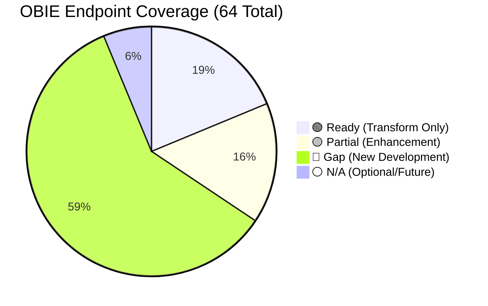
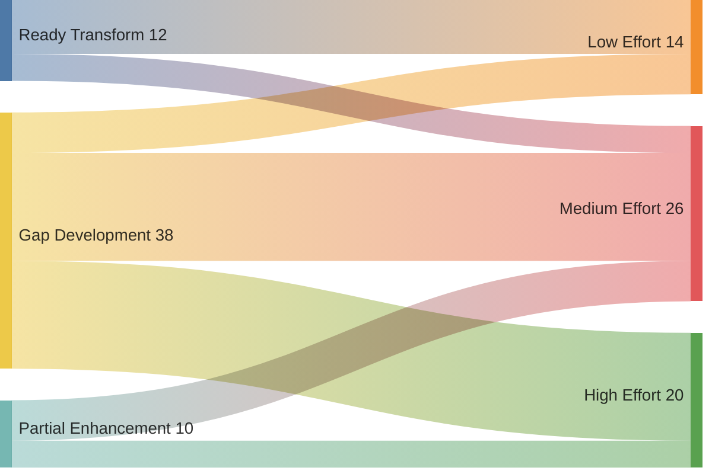
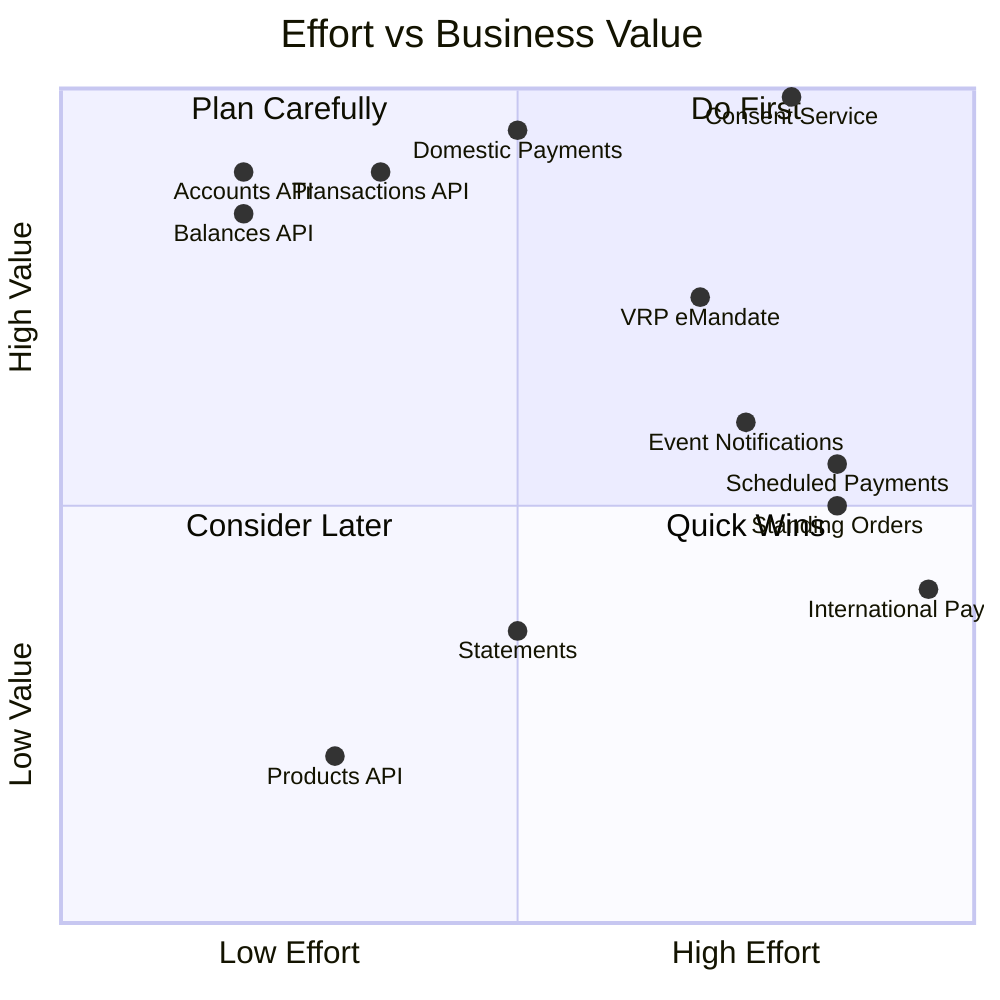
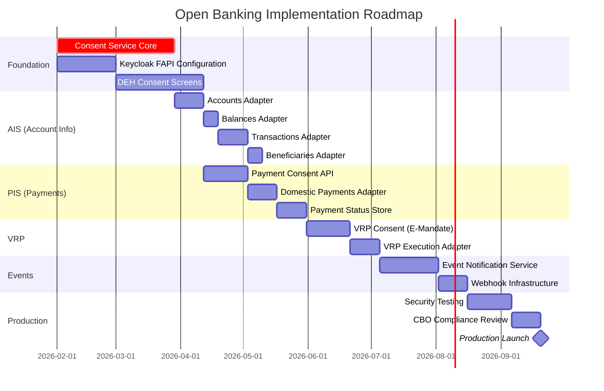

# Bank Dhofar Open Banking Coverage Analysis

## Document Information

| Item | Value |
|------|-------|
| Version | 1.0 |
| Date | January 2026 |
| Status | Draft |
| OBIE Version | 4.0 |

---

## 1. OBIE API Specifications Overview

OBIE provides **6 API Specifications**, each containing **multiple endpoints**:

| # | Specification | Endpoints | Description |
|---|---------------|-----------|-------------|
| 1 | **Account Information (AIS)** | 23 | Account data, balances, transactions, beneficiaries |
| 2 | **Payment Initiation (PIS)** | 24 | Domestic, scheduled, standing order, international payments |
| 3 | **Confirmation of Funds (CoF)** | 4 | Balance sufficiency check |
| 4 | **Variable Recurring Payments (VRP)** | 6 | Sweeping, subscription payments |
| 5 | **Event Notifications** | 4 | Real-time webhooks to TPPs |
| 6 | **Events Aggregation** | 3 | Polling-based event retrieval |
| | **TOTAL** | **64** | |

---

## 2. Coverage Heatmap

### Legend

| Symbol | Meaning | Description |
|--------|---------|-------------|
| 🟢 | **Ready** | Existing API available, needs transformation only |
| 🟡 | **Partial** | Partial functionality exists, needs enhancement |
| 🔴 | **Gap** | No existing capability, requires new development |
| ⚪ | **N/A** | Not applicable or optional for Oman market |

---

## 3. Account Information Service (AIS) - 23 Endpoints

### 3.1 Consent Management

| OBIE Endpoint | Method | Bank Dhofar Source | Status | Effort | Notes |
|---------------|--------|-------------------|--------|--------|-------|
| `/account-access-consents` | POST | — | 🔴 Gap | High | New consent service |
| `/account-access-consents/{ConsentId}` | GET | — | 🔴 Gap | Medium | New consent service |
| `/account-access-consents/{ConsentId}` | DELETE | — | 🔴 Gap | Medium | New consent service |

### 3.2 Account Resources

| OBIE Endpoint | Method | Bank Dhofar Source | Status | Effort | Notes |
|---------------|--------|-------------------|--------|--------|-------|
| `/accounts` | GET | Corporate `/operative/accounts` | 🟢 Ready | Low | Transform response |
| `/accounts/{AccountId}` | GET | Corporate `/operative/accounts` | 🟢 Ready | Low | Filter from list |
| `/accounts/{AccountId}/balances` | GET | Corporate `/account/balance` | 🟢 Ready | Low | Transform response |
| `/accounts/{AccountId}/transactions` | GET | Corporate `/account/history` | 🟢 Ready | Medium | Add pagination |
| `/accounts/{AccountId}/beneficiaries` | GET | Corporate `/beneficiary/list` | 🟢 Ready | Low | Transform response |
| `/accounts/{AccountId}/direct-debits` | GET | E-Mandate `/mandates/list` | 🟡 Partial | Medium | Map mandate structure |
| `/accounts/{AccountId}/standing-orders` | GET | — | 🔴 Gap | High | Finacle enhancement |
| `/accounts/{AccountId}/scheduled-payments` | GET | — | 🔴 Gap | High | Finacle enhancement |
| `/accounts/{AccountId}/statements` | GET | — | 🔴 Gap | Medium | PDF generation |
| `/accounts/{AccountId}/statements/{StatementId}` | GET | — | 🔴 Gap | Medium | PDF retrieval |
| `/accounts/{AccountId}/statements/{StatementId}/file` | GET | — | 🔴 Gap | Medium | PDF download |
| `/accounts/{AccountId}/statements/{StatementId}/transactions` | GET | Corporate `/account/history` | 🟡 Partial | Medium | Statement-filtered |
| `/accounts/{AccountId}/product` | GET | — | 🔴 Gap | Low | Product catalog |
| `/accounts/{AccountId}/offers` | GET | — | ⚪ N/A | — | Marketing, optional |
| `/accounts/{AccountId}/party` | GET | Corporate (partial) | 🟡 Partial | Medium | Customer details |
| `/accounts/{AccountId}/parties` | GET | — | 🔴 Gap | Medium | Joint account holders |

### 3.3 Bulk Resources

| OBIE Endpoint | Method | Bank Dhofar Source | Status | Effort | Notes |
|---------------|--------|-------------------|--------|--------|-------|
| `/balances` | GET | Multiple balance calls | 🟢 Ready | Medium | Aggregate |
| `/transactions` | GET | Multiple history calls | 🟢 Ready | Medium | Aggregate |
| `/beneficiaries` | GET | Multiple beneficiary calls | 🟢 Ready | Medium | Aggregate |
| `/direct-debits` | GET | E-Mandate list | 🟡 Partial | Medium | Aggregate |
| `/standing-orders` | GET | — | 🔴 Gap | High | Requires Finacle |
| `/scheduled-payments` | GET | — | 🔴 Gap | High | Requires Finacle |

---

## 4. Payment Initiation Service (PIS) - 24 Endpoints

### 4.1 Domestic Payments (Immediate)

| OBIE Endpoint | Method | Bank Dhofar Source | Status | Effort | Notes |
|---------------|--------|-------------------|--------|--------|-------|
| `/domestic-payment-consents` | POST | — | 🔴 Gap | High | Consent service |
| `/domestic-payment-consents/{ConsentId}` | GET | — | 🔴 Gap | Medium | Consent service |
| `/domestic-payment-consents/{ConsentId}/funds-confirmation` | GET | Corporate `/account/balance` | 🟢 Ready | Low | Balance check |
| `/domestic-payments` | POST | Corporate `/fund/transfer` | 🟢 Ready | Medium | Transform request |
| `/domestic-payments/{DomesticPaymentId}` | GET | — | 🔴 Gap | Medium | Payment status store |
| `/domestic-payments/{DomesticPaymentId}/payment-details` | GET | — | 🔴 Gap | Medium | Payment details |

### 4.2 Domestic Scheduled Payments

| OBIE Endpoint | Method | Bank Dhofar Source | Status | Effort | Notes |
|---------------|--------|-------------------|--------|--------|-------|
| `/domestic-scheduled-payment-consents` | POST | — | 🔴 Gap | High | Consent + scheduling |
| `/domestic-scheduled-payment-consents/{ConsentId}` | GET | — | 🔴 Gap | Medium | — |
| `/domestic-scheduled-payments` | POST | — | 🔴 Gap | High | Finacle scheduling |
| `/domestic-scheduled-payments/{Id}` | GET | — | 🔴 Gap | Medium | — |
| `/domestic-scheduled-payments/{Id}/payment-details` | GET | — | 🔴 Gap | Medium | — |

### 4.3 Domestic Standing Orders

| OBIE Endpoint | Method | Bank Dhofar Source | Status | Effort | Notes |
|---------------|--------|-------------------|--------|--------|-------|
| `/domestic-standing-order-consents` | POST | E-Mandate `/initiate` | 🟡 Partial | High | Different model |
| `/domestic-standing-order-consents/{ConsentId}` | GET | E-Mandate status | 🟡 Partial | Medium | — |
| `/domestic-standing-orders` | POST | E-Mandate `/bulkPayment/release` | 🟡 Partial | High | Execution mapping |
| `/domestic-standing-orders/{Id}` | GET | E-Mandate status | 🟡 Partial | Medium | — |
| `/domestic-standing-orders/{Id}/payment-details` | GET | — | 🔴 Gap | Medium | — |

### 4.4 International Payments

| OBIE Endpoint | Method | Bank Dhofar Source | Status | Effort | Notes |
|---------------|--------|-------------------|--------|--------|-------|
| `/international-payment-consents` | POST | — | 🔴 Gap | High | Future phase |
| `/international-payment-consents/{ConsentId}` | GET | — | 🔴 Gap | Medium | Future phase |
| `/international-payments` | POST | — | 🔴 Gap | High | SWIFT integration |
| `/international-payments/{Id}` | GET | — | 🔴 Gap | Medium | — |
| `/international-scheduled-payments/*` | * | — | ⚪ N/A | — | Phase 2+ |
| `/international-standing-orders/*` | * | — | ⚪ N/A | — | Phase 2+ |

---

## 5. Confirmation of Funds (CoF) - 4 Endpoints

| OBIE Endpoint | Method | Bank Dhofar Source | Status | Effort | Notes |
|---------------|--------|-------------------|--------|--------|-------|
| `/funds-confirmation-consents` | POST | — | 🔴 Gap | Medium | Consent service |
| `/funds-confirmation-consents/{ConsentId}` | GET | — | 🔴 Gap | Low | Consent service |
| `/funds-confirmation-consents/{ConsentId}` | DELETE | — | 🔴 Gap | Low | Consent service |
| `/funds-confirmations` | POST | Corporate `/account/balance` | 🟢 Ready | Low | Boolean response |

---

## 6. Variable Recurring Payments (VRP) - 6 Endpoints

| OBIE Endpoint | Method | Bank Dhofar Source | Status | Effort | Notes |
|---------------|--------|-------------------|--------|--------|-------|
| `/domestic-vrp-consents` | POST | E-Mandate `/initiate` | 🟡 Partial | High | Map mandate |
| `/domestic-vrp-consents/{ConsentId}` | GET | E-Mandate status | 🟡 Partial | Medium | — |
| `/domestic-vrp-consents/{ConsentId}` | DELETE | E-Mandate `/terminate` | 🟡 Partial | Medium | — |
| `/domestic-vrp-consents/{ConsentId}/funds-confirmation` | POST | Corporate `/account/balance` | 🟢 Ready | Low | — |
| `/domestic-vrps` | POST | E-Mandate `/bulkPayment/release` | 🟡 Partial | High | Execute payment |
| `/domestic-vrps/{DomesticVRPId}` | GET | E-Mandate `/bulkPayment/response` | 🟡 Partial | Medium | — |

---

## 7. Event Notifications - 4 Endpoints

| OBIE Endpoint | Method | Bank Dhofar Source | Status | Effort | Notes |
|---------------|--------|-------------------|--------|--------|-------|
| `/event-subscriptions` | POST | — | 🔴 Gap | High | New service |
| `/event-subscriptions/{Id}` | GET | — | 🔴 Gap | Low | — |
| `/event-subscriptions/{Id}` | PUT | — | 🔴 Gap | Low | — |
| `/event-subscriptions/{Id}` | DELETE | — | 🔴 Gap | Low | — |

---

## 8. Events Aggregation - 3 Endpoints

| OBIE Endpoint | Method | Bank Dhofar Source | Status | Effort | Notes |
|---------------|--------|-------------------|--------|--------|-------|
| `/events` | POST | — | 🔴 Gap | High | New service |
| `/events` | GET | — | 🔴 Gap | Medium | Polling endpoint |
| `/events` | DELETE | — | 🔴 Gap | Low | — |

---

## 9. Coverage Summary

### 9.1 Overall Statistics

### 9.2 By Category

| Category | Total | 🟢 Ready | 🟡 Partial | 🔴 Gap | ⚪ N/A | Coverage |
|----------|-------|---------|-----------|-------|-------|----------|
| **AIS - Consent** | 3 | 0 | 0 | 3 | 0 | 0% |
| **AIS - Accounts** | 16 | 5 | 3 | 7 | 1 | 31% |
| **AIS - Bulk** | 6 | 3 | 1 | 2 | 0 | 50% |
| **PIS - Domestic** | 6 | 2 | 0 | 4 | 0 | 33% |
| **PIS - Scheduled** | 5 | 0 | 0 | 5 | 0 | 0% |
| **PIS - Standing Order** | 5 | 0 | 4 | 1 | 0 | 0% (partial) |
| **PIS - International** | 4+ | 0 | 0 | 2 | 2+ | 0% |
| **CoF** | 4 | 1 | 0 | 3 | 0 | 25% |
| **VRP** | 6 | 1 | 4 | 1 | 0 | 17% (partial) |
| **Events** | 7 | 0 | 0 | 7 | 0 | 0% |
| **TOTAL** | **64** | **12** | **10** | **38** | **4** | **19%** |

### 9.3 Coverage by Effort

---

## 10. Detailed Heatmap Visualization

### 10.1 Functional Coverage Matrix

| Functionality | Account Info | Payments | VRP | Events | Overall |
|---------------|:------------:|:--------:|:---:|:------:|:-------:|
| **View Accounts** | 🟢 | — | — | — | 🟢 |
| **View Balances** | 🟢 | — | — | — | 🟢 |
| **View Transactions** | 🟢 | — | — | — | 🟢 |
| **View Beneficiaries** | 🟢 | — | — | — | 🟢 |
| **View Direct Debits** | 🟡 | — | — | — | 🟡 |
| **View Standing Orders** | 🔴 | — | — | — | 🔴 |
| **View Scheduled Payments** | 🔴 | — | — | — | 🔴 |
| **View Products** | 🔴 | — | — | — | 🔴 |
| **View Party Info** | 🟡 | — | — | — | 🟡 |
| **Consent Management** | 🔴 | 🔴 | 🔴 | — | 🔴 |
| **Domestic Payments** | — | 🟢 | — | — | 🟢 |
| **Scheduled Payments** | — | 🔴 | — | — | 🔴 |
| **Standing Orders** | — | 🟡 | — | — | 🟡 |
| **International Payments** | — | 🔴 | — | — | 🔴 |
| **Funds Confirmation** | — | 🟢 | 🟢 | — | 🟢 |
| **VRP Consent** | — | — | 🟡 | — | 🟡 |
| **VRP Execution** | — | — | 🟡 | — | 🟡 |
| **Event Subscriptions** | — | — | — | 🔴 | 🔴 |
| **Event Polling** | — | — | — | 🔴 | 🔴 |
| **Real-time Webhooks** | — | — | — | 🔴 | 🔴 |

### 10.2 Priority Matrix

---

## 11. Existing Bank Dhofar APIs Inventory

### 11.1 Corporate Banking APIs (9 APIs)

| # | API Name | Endpoint | Maps to OBIE | Notes |
|---|----------|----------|--------------|-------|
| 1 | Token Generation | `/oauth2/token` | OAuth2 | Keep for corporate; OBIE uses FAPI |
| 2 | Operative Account Listing | `/operative/accounts` | `/accounts` | 🟢 Direct mapping |
| 3 | Account Balance Inquiry | `/account/balance` | `/accounts/{id}/balances` | 🟢 Transform |
| 4 | Beneficiary Listing | `/beneficiary/list` | `/accounts/{id}/beneficiaries` | 🟢 Transform |
| 5 | Fund Transfer | `/fund/transfer` | `/domestic-payments` | 🟢 Transform |
| 6 | Mini Statement | `/account/miniStatement` | `/accounts/{id}/transactions` | 🟢 Subset |
| 7 | Transaction History | `/account/history` | `/accounts/{id}/transactions` | 🟢 Full mapping |
| 8 | Deposit Account Listing | `/deposit/accounts` | `/accounts` (filter) | 🟢 Merge |
| 9 | Loan Account Listing | `/loan/accounts` | `/accounts` (filter) | 🟢 Merge |

### 11.2 EasyBiz Payment APIs (9 APIs)

| # | API Name | Endpoint | Maps to OBIE | Notes |
|---|----------|----------|--------------|-------|
| 1 | Create Customer | `/CreateContact` | — | B2B only, not OBIE scope |
| 2 | Update Customer | `/UpdateContact` | — | B2B only |
| 3 | Fetch Virtual Account | `/fetchVirtualAccount` | — | B2B only |
| 4 | Payment - Basic | `/Payment` | — | Collection, not initiation |
| 5 | Payment - Detailed | `/Payment/detailed` | — | Collection |
| 6 | Check Payment Status | `/Payment/status` | Event source | Can feed events |
| 7 | Update Payment | `/Payment/update` | — | B2B only |
| 8 | Cancel Payment | `/Payment/cancel` | — | B2B only |
| 9 | Token Generation | `/oauth2GetToken` | — | Keep separate |

### 11.3 E-Mandate APIs (9 APIs)

| # | API Name | Endpoint | Maps to OBIE | Notes |
|---|----------|----------|--------------|-------|
| 1 | Company Registration | `/company/register` | TPP onboarding | Separate flow |
| 2 | Initiate Mandate | `/mandates/initiate` | `/domestic-vrp-consents` | 🟡 Transform |
| 3 | Amend Mandate | `/mandates/amend` | PUT `/domestic-vrp-consents` | 🟡 Transform |
| 4 | Terminate Mandate | `/mandates/terminate` | DELETE `/domestic-vrp-consents` | 🟡 Transform |
| 5 | Request Acknowledgement | `/mandates/ack` | — | Internal status |
| 6 | Request Acceptance | `/mandates/accept` | — | Internal status |
| 7 | Bulk Payment Release | `/bulkPayment/release` | POST `/domestic-vrps` | 🟡 Transform |
| 8 | Bulk Payment Response | `/bulkPayment/response` | GET `/domestic-vrps/{id}` | 🟡 Transform |
| 9 | Mandate Status | `/mandates/status` | GET `/domestic-vrp-consents/{id}` | 🟡 Transform |

---

## 12. Gap Closure Roadmap

---

## 13. Implementation Priorities

### Phase 1: Core AIS (High Value, Low-Medium Effort)

| Priority | Endpoint | Source | Effort | Business Value |
|----------|----------|--------|--------|----------------|
| 1 | Consent Service | New | High | Critical |
| 2 | `/accounts` | Corporate APIs | Low | High |
| 3 | `/accounts/{id}/balances` | Corporate APIs | Low | High |
| 4 | `/accounts/{id}/transactions` | Corporate APIs | Medium | High |
| 5 | `/accounts/{id}/beneficiaries` | Corporate APIs | Low | Medium |

### Phase 2: Core PIS (High Value, Medium Effort)

| Priority | Endpoint | Source | Effort | Business Value |
|----------|----------|--------|--------|----------------|
| 6 | `/domestic-payment-consents` | New | High | Critical |
| 7 | `/domestic-payments` | Corporate APIs | Medium | High |
| 8 | `/funds-confirmations` | Corporate APIs | Low | Medium |

### Phase 3: VRP & Events (Medium Value, High Effort)

| Priority | Endpoint | Source | Effort | Business Value |
|----------|----------|--------|--------|----------------|
| 9 | `/domestic-vrp-consents` | E-Mandate | High | Medium |
| 10 | `/domestic-vrps` | E-Mandate | High | Medium |
| 11 | Event Notifications | New | High | Medium |

### Phase 4: Extended Capabilities (Lower Priority)

| Priority | Endpoint | Source | Effort | Business Value |
|----------|----------|--------|--------|----------------|
| 12 | Scheduled Payments | New (Finacle) | High | Low |
| 13 | Standing Orders | New (Finacle) | High | Low |
| 14 | International Payments | New (SWIFT) | Very High | Low |
| 15 | Statements | New | Medium | Low |

---

## 14. Summary

### Current State

| Metric | Value |
|--------|-------|
| Total OBIE Endpoints | 64 |
| Ready (Transform Only) | 12 (19%) |
| Partial (Enhancement Needed) | 10 (16%) |
| Gap (New Development) | 38 (59%) |
| N/A (Optional) | 4 (6%) |
| **Effective Coverage** | **35%** (Ready + Partial) |

### Key Findings

1. **Strong foundation for AIS**: Corporate Banking APIs cover core account/balance/transaction needs
2. **E-Mandate provides VRP base**: Existing mandate infrastructure can be transformed for VRP
3. **Critical gap: Consent Management**: This is the #1 priority - nothing else works without it
4. **Scheduled payments need Finacle**: Standing orders and scheduled payments require core banking changes
5. **Events are fully new**: No existing infrastructure for real-time notifications

### Recommended Approach

1. **Build Consent Service first** - All OBIE APIs require consent
2. **Transform existing Corporate APIs** - Quick wins for AIS
3. **Adapt E-Mandate for VRP** - Leverage existing infrastructure
4. **Defer scheduled/standing orders** - Negotiate with Finacle team
5. **Add Events last** - Nice-to-have, not critical for compliance
