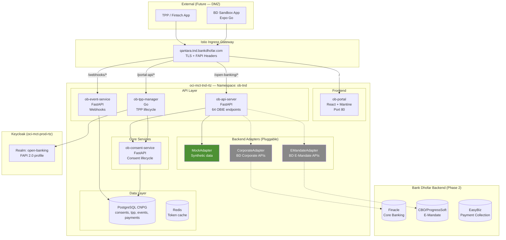
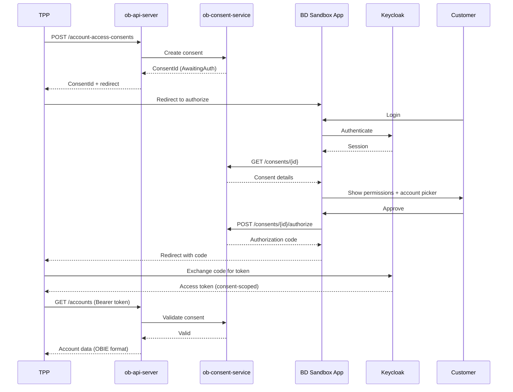

# Qantara — High-Level Design

## 1. Overview

Qantara (قنطرة — Bridge) is Bank Dhofar's Open Banking platform, providing OBIE v4.0 compliant APIs to third-party providers (TPPs/fintechs).

## 2. Architecture

## 3. OBIE API Coverage

| Spec | Endpoints | Status |
|------|-----------|--------|
| Account Information (AIS) | 23 | Mock |
| Payment Initiation (PIS) | 18 | Mock |
| Confirmation of Funds (CoF) | 4 | Mock |
| Variable Recurring Payments (VRP) | 6 | Mock |
| Event Notifications | 7 | Mock |
| Event Subscriptions | 6 | Mock |
| **Total** | **64** | **All Mock (Phase 1)** |

## 4. Consent Flow

## 5. Deployment Phases

| Phase | Where | What |
|-------|-------|------|
| **1 (Current)** | oci-mct-tnd-rtz / ob-tnd | All services, mock adapters, internal testing |
| **2** | Same + real adapters | Corporate Banking + E-Mandate adapter swap |
| **3** | oci-mct-tnd-dmz | DMZ exposure, OPTIONAL_MUTUAL TLS, real fintech onboarding |
| **4** | oci-mct-prod-rtz | Production, CBO compliance |

## 6. Security

| Layer | Mechanism |
|-------|-----------|
| Transport | TLS 1.3 (Istio mesh) |
| API Auth | OAuth2 + PKCE (Keycloak FAPI 2.0) |
| Consent | Per-request validation (consent-scoped tokens) |
| mTLS | OPTIONAL_MUTUAL on DMZ (Phase 3) |
| Rate Limiting | Per-TPP via Envoy (Phase 3) |
| Audit | Full consent history + API access logs |
