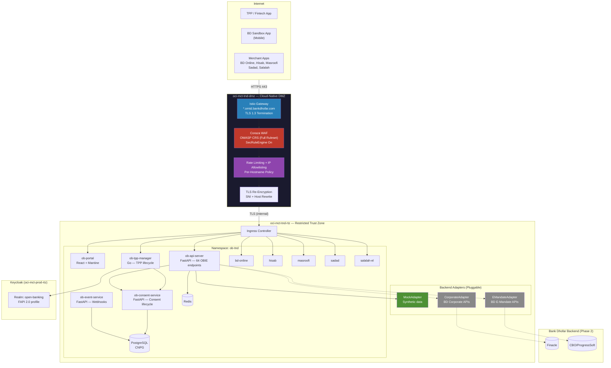
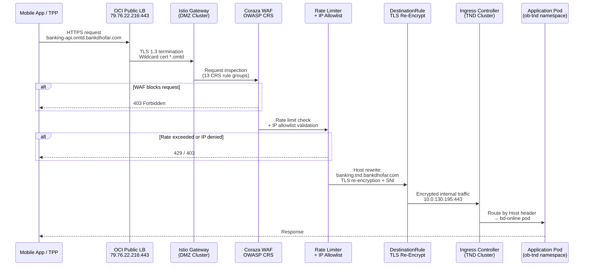
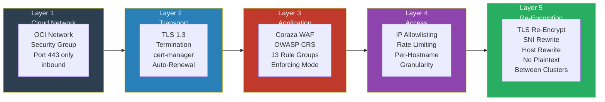
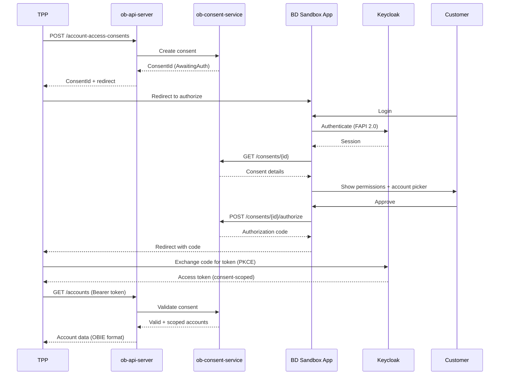
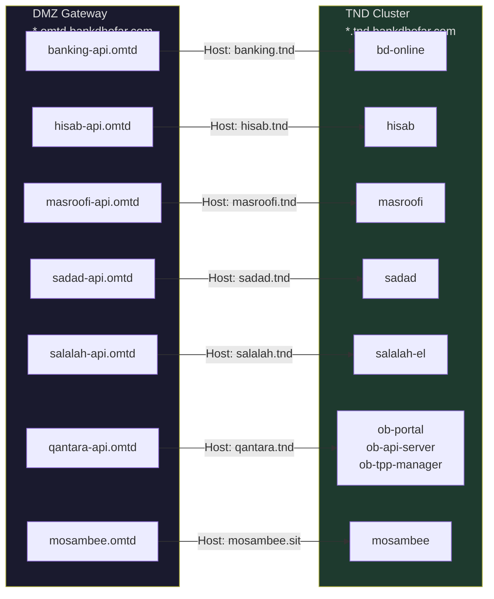
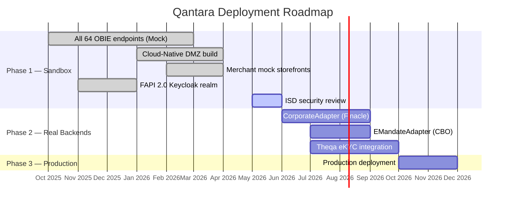
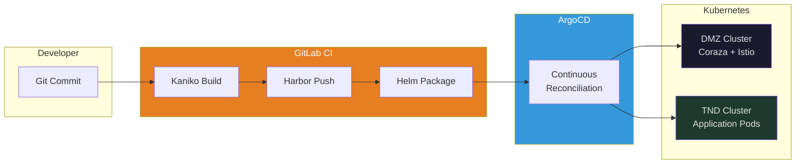

# Qantara — High-Level Design

## 1. Overview

Qantara (قنطرة — Bridge) is Bank Dhofar's Open Banking platform, providing OBIE v4.0 compliant APIs to third-party providers (TPPs/fintechs). The platform is deployed across two Kubernetes clusters — a cloud-native DMZ for internet-facing security and a Restricted Trust Zone for application workloads — following zero-trust principles end to end.

## 2. Architecture

## 3. Cloud-Native DMZ Architecture

The DMZ cluster (`oci-mct-tnd-dmz`) is a **dedicated, fully isolated Kubernetes cluster** serving as the sole internet-facing entry point. It replaces traditional appliance-based WAF/DMZ infrastructure with a programmable, policy-driven, cloud-native security boundary — provisioned entirely through Infrastructure as Code and continuously reconciled via GitOps.

### 3.1 Request Flow (Internet → Application)

### 3.2 Defense in Depth — Five Security Layers

### 3.3 OWASP Top 10 Coverage

The Coraza WAF runs as a Wasm plugin inside the Istio Envoy proxy at the ingress gateway — zero additional network hops. It loads the complete OWASP Core Rule Set (CRS):

| OWASP Top 10 | CRS Rule Groups | Protection |
|---|---|---|
| **A01** Broken Access Control | REQUEST-911-METHOD-ENFORCEMENT, REQUEST-930-LFI | HTTP method restriction, path traversal blocking |
| **A02** Cryptographic Failures | TLS 1.3 at gateway, re-encryption to TND | No plaintext on the wire, automated cert rotation |
| **A03** Injection | REQUEST-932-RCE, REQUEST-941-XSS, REQUEST-942-SQLI, REQUEST-933-PHP, REQUEST-934-GENERIC, REQUEST-944-JAVA | SQL injection, XSS, command injection, code injection |
| **A04** Insecure Design | FAPI 2.0, consent-scoped tokens | OAuth2+PKCE, per-resource consent validation |
| **A05** Security Misconfiguration | REQUEST-920-PROTOCOL-ENFORCEMENT, SecRequestBodyLimit | Protocol validation, body size limits (12.5 MB) |
| **A06** Vulnerable Components | CI-built images only, Harbor registry | No manual builds, no runtime modification |
| **A07** Authentication Failures | REQUEST-913-SCANNER-DETECTION, REQUEST-943-SESSION-FIXATION | Scanner detection, session fixation prevention |
| **A08** Data Integrity Failures | GitOps pipeline (Git → CI → ArgoCD) | Immutable artifacts, continuous reconciliation |
| **A09** Logging & Monitoring | SecAuditEngine → Vector → OpenSearch | Real-time WAF event streaming, centralized SIEM |
| **A10** SSRF | REQUEST-931-RFI, REGISTRY_ONLY outbound | Remote inclusion blocking, outbound traffic lockdown |

### 3.4 DMZ Security Controls

| Control | Technology | Detail |
|---------|-----------|--------|
| **WAF** | Coraza WasmPlugin v0.6.0 | In-process inside Envoy (zero network hop). Full OWASP CRS. `SecRuleEngine On` (enforcing). Request body inspection enabled. |
| **TLS Termination** | Istio Gateway + cert-manager | Wildcard `*.omtd.bankdhofar.com`. Let's Encrypt ACME, auto-renewal. TLS 1.3. |
| **TLS Re-Encryption** | Istio DestinationRule | SNI rewrite to TND hostnames. No plaintext between clusters. |
| **IP Allowlisting** | Istio AuthorizationPolicy | DENY + `notIpBlocks` per hostname. Per-app granularity. |
| **Rate Limiting** | Envoy Local Rate Limit | 100 req/s per source IP, 500 burst. Per virtual host. |
| **Outbound Lockdown** | `REGISTRY_ONLY` mesh policy | No implicit outbound. Every upstream explicitly registered. Prevents exfiltration / C2. |
| **HTTP Redirect** | HTTPRoute `tls-redirect` | All HTTP/80 → HTTPS/301. No plaintext API access. |
| **Request Size Limit** | `SecRequestBodyLimit` | 12.5 MB max. Prevents oversized payload abuse. |
| **Audit Logging** | Coraza → stdout → Vector → OpenSearch | Real-time WAF event streaming for SIEM integration. |

### 3.5 Cloud-Native DMZ vs Traditional Appliance WAF

| Capability | Traditional Appliance WAF | Qantara Cloud-Native DMZ |
|---|---|---|
| **Deployment model** | Physical/virtual appliance, manual config | Kubernetes-native, declarative YAML, GitOps-driven |
| **Scaling** | Vertical (larger appliance) | Horizontal auto-scaling (HPA, 1–N replicas) |
| **Rule updates** | Manual vendor patches, change windows | Git commit → ArgoCD sync, OWASP CRS versioned |
| **Configuration drift** | Common, difficult to detect | Impossible — ArgoCD continuously reconciles desired state |
| **Observability** | Vendor-proprietary dashboard | OpenSearch + Vector pipeline, open standard log format |
| **Multi-tenancy** | Shared appliance, blast radius = all apps | Per-hostname policies, per-app rate limits and ACLs |
| **TLS management** | Manual cert rotation, outage risk | cert-manager auto-renewal, zero-downtime rotation |
| **Infrastructure as Code** | Rarely or partially | 100% — every resource is a versioned, auditable Git artifact |
| **Disaster recovery** | Active-passive, manual failover | Redeploy entire DMZ from Git to any cluster in minutes |
| **Cost model** | CapEx licensing + annual support contracts | Open source stack (Coraza, Istio, CRS), OpEx only |
| **Vendor lock-in** | High (F5, Imperva, Fortinet, etc.) | None — entirely CNCF-standard components |

## 4. OBIE API Coverage

| Spec | Endpoints | Status |
|------|-----------|--------|
| Account Information (AIS) | 23 | Mock |
| Payment Initiation (PIS) | 18 | Mock |
| Confirmation of Funds (CoF) | 4 | Mock |
| Variable Recurring Payments (VRP) | 6 | Mock |
| Event Notifications | 7 | Mock |
| Event Subscriptions | 6 | Mock |
| **Total** | **64** | **All Mock (Phase 1)** |

## 5. Consent Flow

## 6. Public Endpoints

### DMZ-Exposed Services (*.omtd.bankdhofar.com)

## 7. Application Security (TND Layer)

| Control | Implementation |
|---------|----------------|
| **API Authentication** | OAuth2 + PKCE (Keycloak FAPI 2.0) |
| **Consent Validation** | Per-request consent check, consent-scoped tokens |
| **FAPI Compliance** | `x-fapi-interaction-id` on every response, financial-grade security profile |
| **Error Handling** | OBIE standard format `{ Code, Id, Message, Errors[] }` |
| **Audit Trail** | Full consent history, API access logs, immutable event records |
| **Data Layer** | PostgreSQL (CNPG) with automated backups, Redis for token cache |

## 8. Deployment Phases

## 9. IaC and GitOps Pipeline

