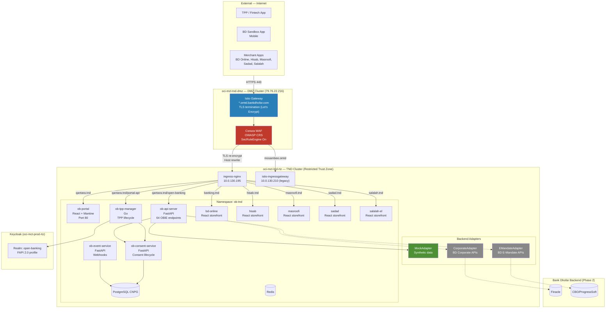
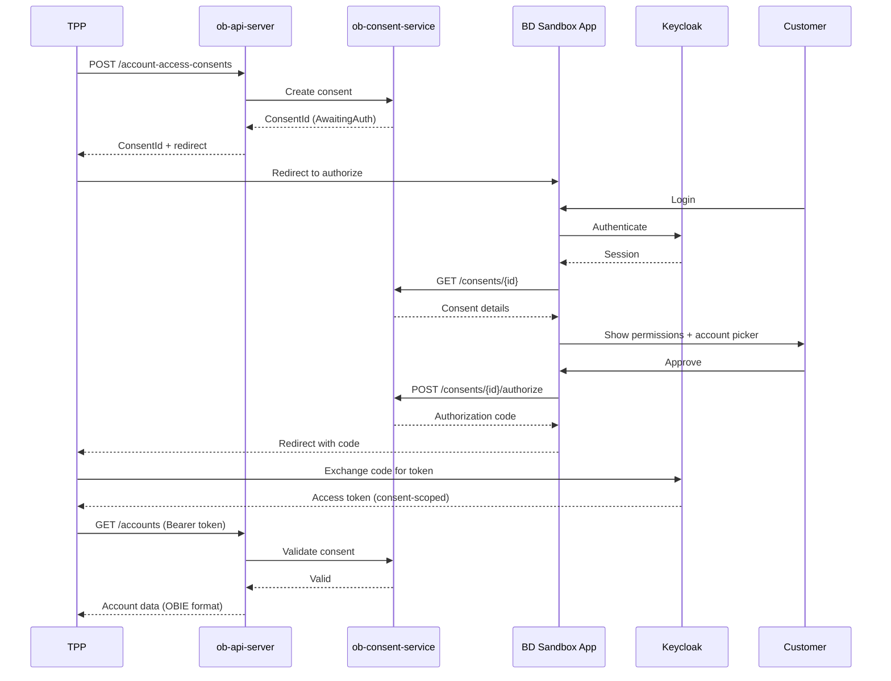

# Qantara — High-Level Design

## 1. Overview

Qantara (قنطرة — Bridge) is Bank Dhofar's Open Banking platform, providing OBIE v4.0 compliant APIs to third-party providers (TPPs/fintechs).

## 2. Architecture



## 3. OBIE API Coverage

| Spec | Endpoints | Status |
|------|-----------|--------|
| Account Information (AIS) | 23 | Mock |
| Payment Initiation (PIS) | 18 | Mock |
| Confirmation of Funds (CoF) | 4 | Mock |
| Variable Recurring Payments (VRP) | 6 | Mock |
| Event Notifications | 7 | Mock |
| Event Subscriptions | 6 | Mock |
| **Total** | **64** | **All Mock (Phase 1)** |

## 4. Consent Flow



## 5. Deployment

### Clusters

| Cluster | Context | Role |
|---------|---------|------|
| **OCI Muscat DMZ** | `oci-mct-tnd-dmz` | Internet-facing reverse proxy, WAF, TLS termination |
| **OCI Muscat TND** | `oci-mct-tnd-rtz` | Application workloads, namespace `ob-tnd` |

### Request Flow (Internet → Application)

```
Mobile/TPP → 79.76.22.216:443
  → Istio Gateway (TLS termination, *.omtd.bankdhofar.com)
    → Coraza WAF (OWASP CRS inspection)
      → HTTPRoute (host-based routing + Host header rewrite)
        → DestinationRule (TLS re-encryption + SNI rewrite)
          → TND ingress-nginx 10.0.130.195
            → Kubernetes Ingress → ob-tnd pods
```

### Public Endpoints (DMZ)

| Public URL | Host Rewrite | Target Service |
|------------|-------------|----------------|
| `banking-api.omtd.bankdhofar.com` | `banking.tnd.bankdhofar.com` | bd-online |
| `hisab-api.omtd.bankdhofar.com` | `hisab.tnd.bankdhofar.com` | hisab |
| `masroofi-api.omtd.bankdhofar.com` | `masroofi.tnd.bankdhofar.com` | masroofi |
| `sadad-api.omtd.bankdhofar.com` | `sadad.tnd.bankdhofar.com` | sadad |
| `salalah-api.omtd.bankdhofar.com` | `salalah.tnd.bankdhofar.com` | salalah-el |
| `qantara-api.omtd.bankdhofar.com` | `qantara.tnd.bankdhofar.com` | qantara platform |
| `mosambee.omtd.bankdhofar.com` | `mosambee.sit.bankdhofar.com` | mosambee POS |

### Phases

| Phase | What |
|-------|------|
| **1 (Current)** | All services deployed, mock adapters, DMZ internet exposure active |
| **2** | Corporate Banking + E-Mandate adapter swap |
| **3** | Production (`oci-mct-prod-rtz`) |

## 6. Security

### DMZ Layer (oci-mct-tnd-dmz)

| Control | Implementation | Config Location |
|---------|----------------|-----------------|
| WAF | Coraza WasmPlugin, OWASP CRS, `SecRuleEngine On` | `infra` repo: `overlays/oci-bankdhofar-muscat-dmz/istio/gateways/ingress.yaml` |
| TLS termination | Istio Gateway, Let's Encrypt cert | Same file — Gateway resource |
| TLS re-encryption | DestinationRule SIMPLE TLS + SNI rewrite to TND | Per-app routing YAML in `infra` repo |
| HTTP redirect | HTTPRoute `tls-redirect`, 301 to HTTPS | `overlays/oci-bankdhofar-muscat-dmz/istio/gateways/http-redirect.yaml` |
| Request body limit | 12.5 MB (`SecRequestBodyLimit 13107200`) | WasmPlugin directives |
| IP allowlisting | AuthorizationPolicy DENY + notIpBlocks per hostname | Per-app routing YAML |
| Rate limiting | EnvoyFilter local rate-limit, 100 req/s per IP, 500 burst | Per-app routing YAML |
| Outbound lockdown | `outboundTrafficPolicy: REGISTRY_ONLY` | Istio mesh config |
| Audit logging | `SecAuditEngine RelevantOnly` → stdout → Vector → OpenSearch | WasmPlugin directives |

### Application Layer (oci-mct-tnd-rtz)

| Control | Implementation |
|---------|----------------|
| API Auth | OAuth2 + PKCE (Keycloak FAPI 2.0) |
| Consent | Per-request validation (consent-scoped tokens) |
| FAPI headers | `x-fapi-interaction-id` on every response |
| Error format | OBIE standard `{ Code, Id, Message, Errors[] }` |
| Audit | Full consent history + API access logs |
