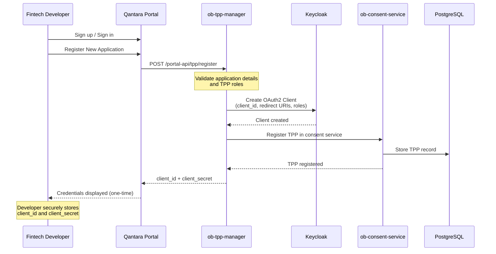
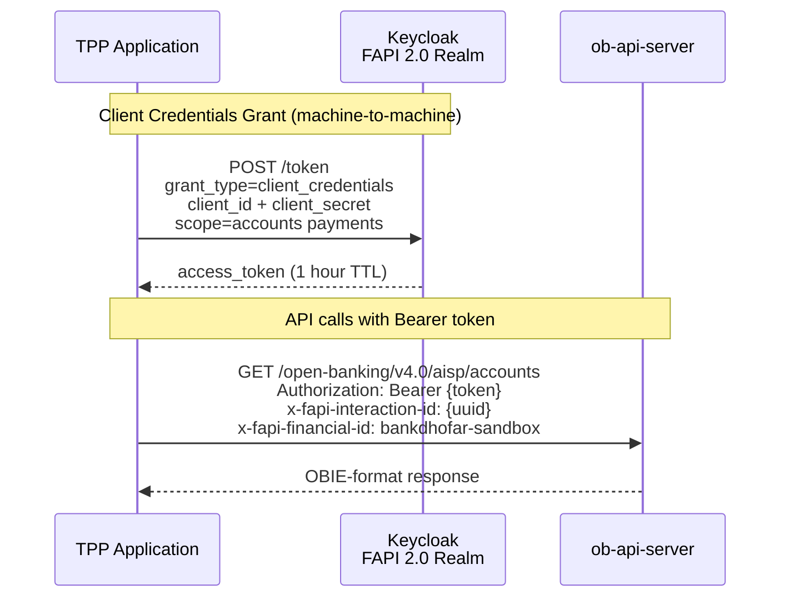
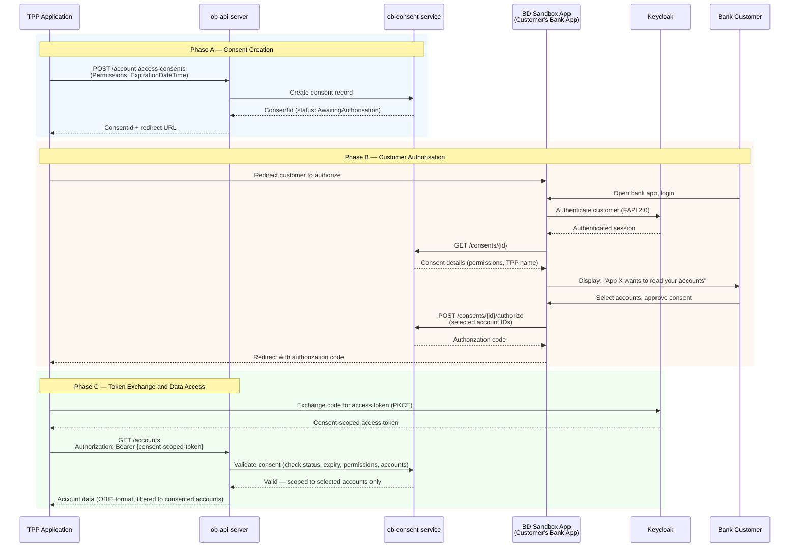
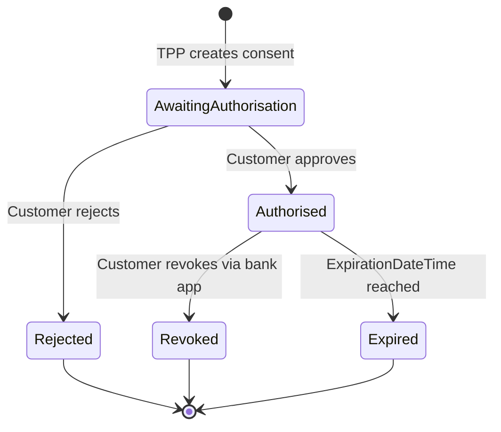

# Fintech Developer Journey

This document describes the end-to-end journey for a fintech developer (TPP) integrating with Bank Dhofar's Open Banking APIs through the Qantara platform.

## Journey Overview

```mermaid
flowchart LR
    subgraph Phase1["1. Discover"]
        Portal["Visit Qantara\nDeveloper Portal"]
        Catalog["Browse\nAPI Catalog"]
        Docs["Read\nDocumentation"]
    end

    subgraph Phase2["2. Register"]
        Account["Create Developer\nAccount"]
        App["Register TPP\nApplication"]
        Roles["Select Roles\nAISP / PISP / CBPII"]
    end

    subgraph Phase3["3. Integrate"]
        Creds["Receive\nCredentials"]
        Cert["Upload mTLS\nCertificate"]
        Token["Obtain\nAccess Token"]
    end

    subgraph Phase4["4. Build"]
        Consent["Create\nConsent"]
        Auth["Customer\nAuthorises"]
        API["Call OBIE\nEndpoints"]
    end

    subgraph Phase5["5. Go Live"]
        Test["Sandbox\nTesting"]
        Review["Security\nReview"]
        Prod["Production\nAccess"]
    end

    Phase1 --> Phase2 --> Phase3 --> Phase4 --> Phase5

    style Phase1 fill:#2980b9,color:#fff
    style Phase2 fill:#8e44ad,color:#fff
    style Phase3 fill:#d35400,color:#fff
    style Phase4 fill:#27ae60,color:#fff
    style Phase5 fill:#c0392b,color:#fff
```

## Step 1 — Discover

The developer starts at the **Qantara Developer Portal**:

| Resource | URL | What It Provides |
|---|---|---|
| Developer Portal | `https://qantara.tnd.bankdhofar.com/` | Landing page, overview, navigation |
| API Catalog | `https://qantara.tnd.bankdhofar.com/apis` | All 64 OBIE endpoints, OpenAPI specs, try-it console |
| Getting Started | `https://qantara.tnd.bankdhofar.com/getting-started` | Step-by-step integration guide with code samples |
| Sandbox Console | `https://qantara.tnd.bankdhofar.com/sandbox` | Interactive API testing without writing code |
| API Docs (Swagger) | `https://qantara.tnd.bankdhofar.com/docs` | Auto-generated OpenAPI documentation |
| API Docs (ReDoc) | `https://qantara.tnd.bankdhofar.com/redoc` | Alternative API documentation format |

## Step 2 — Register as a TPP

### TPP Roles

| Role | Full Name | What It Allows |
|---|---|---|
| **AISP** | Account Information Service Provider | Read account data, balances, transactions, beneficiaries, standing orders |
| **PISP** | Payment Initiation Service Provider | Initiate domestic payments, scheduled payments, international payments |
| **CBPII** | Card Based Payment Instrument Issuer | Confirm whether funds are available in a customer's account |

### TPP Management API

| Endpoint | Method | Purpose |
|---|---|---|
| `/portal-api/tpp/register` | POST | Register a new TPP application |
| `/portal-api/tpp/` | GET | List all registered TPPs |
| `/portal-api/tpp/{id}` | GET | Get TPP details |
| `/portal-api/tpp/{id}` | PUT | Update TPP details |
| `/portal-api/tpp/{id}` | DELETE | Suspend a TPP |
| `/portal-api/tpp/{id}/credentials` | POST | Regenerate client credentials |
| `/portal-api/tpp/{id}/certificate` | POST | Upload mTLS client certificate |
| `/portal-api/tpp/{id}/certificate` | GET | Get certificate metadata |
| `/portal-api/tpp/{id}/sandbox-token` | POST | Generate a sandbox access token |

## Step 3 — Authenticate and Obtain Tokens

### Authentication Endpoints

| Endpoint | Value |
|---|---|
| Token URL | `https://auth.qantara.tnd.bankdhofar.com/realms/open-banking/protocol/openid-connect/token` |
| Grant Type | `client_credentials` |
| Scopes | `accounts`, `payments`, `fundsconfirmations` |
| Token Validity | 3600 seconds (1 hour) |

### Required FAPI Headers

| Header | Purpose | Value |
|---|---|---|
| `Authorization` | Bearer token | `Bearer {access_token}` |
| `x-fapi-financial-id` | Financial institution identifier | `bankdhofar-sandbox` |
| `x-fapi-interaction-id` | Unique request correlation ID | UUID (generated per request) |
| `Content-Type` | Request format | `application/json` |

## Step 4 — Consent and API Access

The consent flow follows the OBIE standard. No data is accessible without explicit customer authorization.

### Consent Lifecycle States

## Step 5 — Sandbox Testing

The sandbox environment provides pre-seeded test data for immediate integration testing:

### Sandbox Test Customers

| Customer | ID | Accounts | Purpose |
|---|---|---|---|
| Ahmed Al-Balushi | CUST-001 | Current + Savings | Standard account holder |
| Fatima Al-Rashdi | CUST-002 | Current + Credit Card | Multi-product holder |

### Sandbox Merchant Storefronts

Mock merchant applications that demonstrate real-world payment flows:

| Storefront | URL | Use Case |
|---|---|---|
| BD Online Banking | `https://banking.tnd.bankdhofar.com/` | Online banking payments |
| Hisab | `https://hisab.tnd.bankdhofar.com/` | Accounting platform payments |
| Masroofi | `https://masroofi.tnd.bankdhofar.com/` | Digital wallet top-up |
| Sadad | `https://sadad.tnd.bankdhofar.com/` | Bill payments |
| Salalah Electronics | `https://salalah.tnd.bankdhofar.com/` | E-commerce checkout |
| Muscat Motors | `https://muscatmotors.tnd.bankdhofar.com/` | Automotive finance |

### Mobile Testing

The **ob-sandbox-app** (Expo/React Native) simulates the customer's banking app for testing the consent authorization flow on mobile devices. Distributed via TestFlight.
