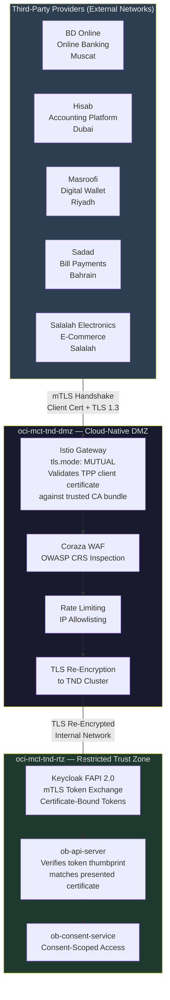
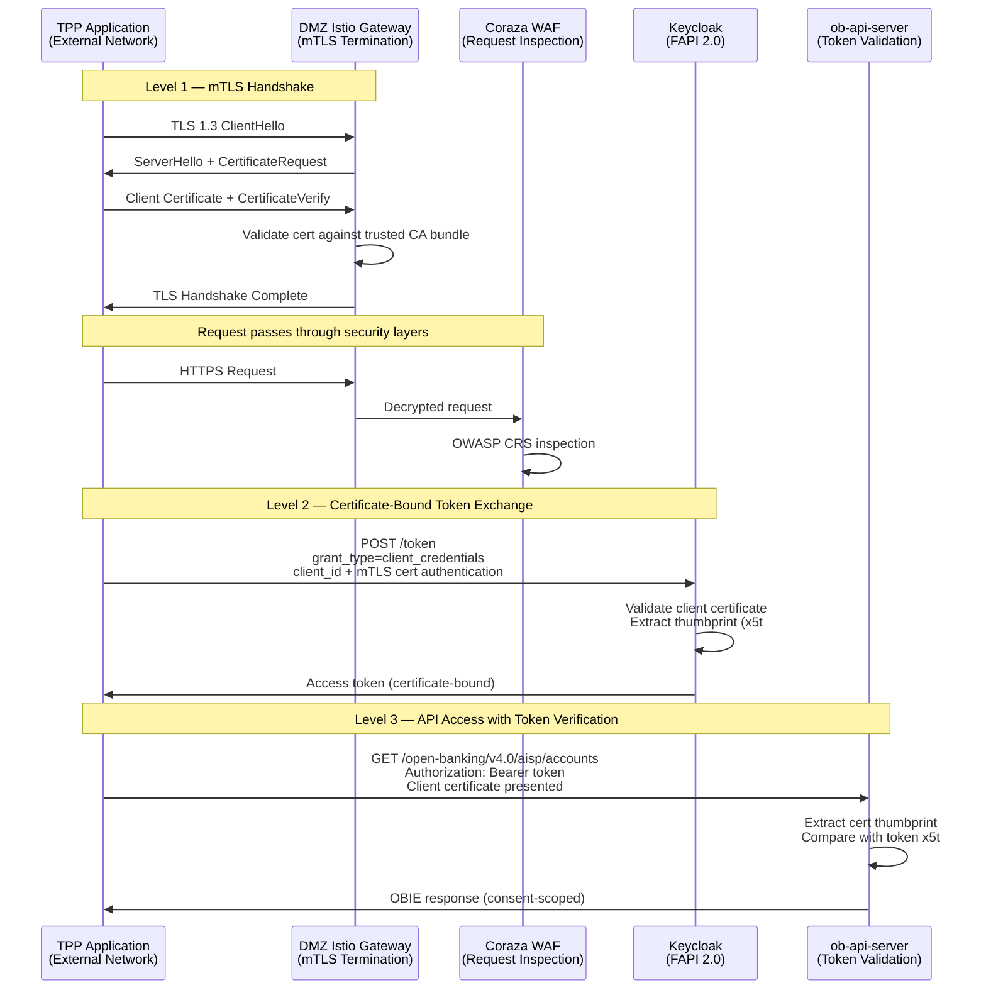
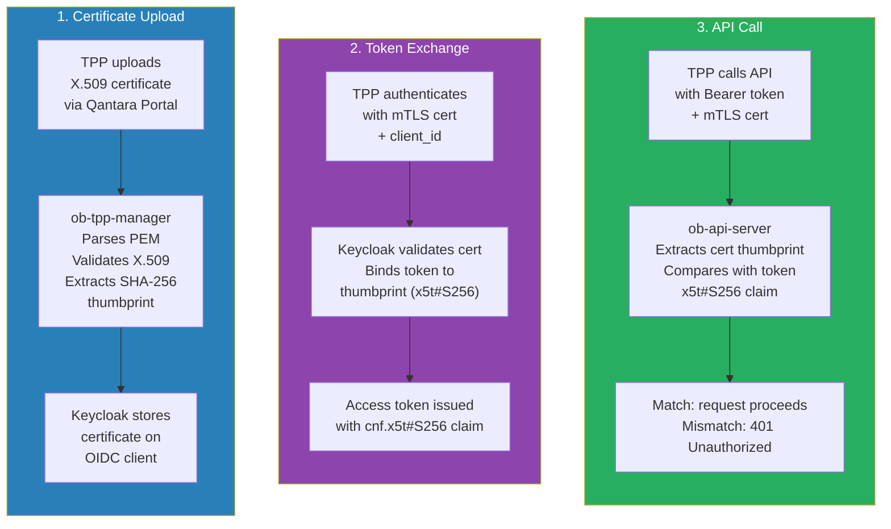
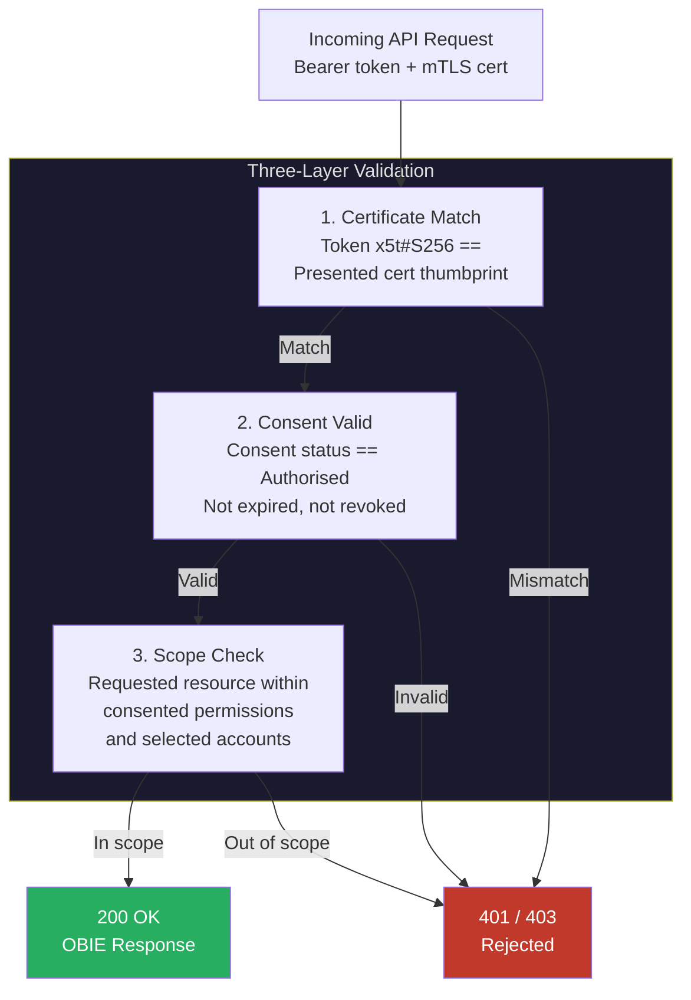
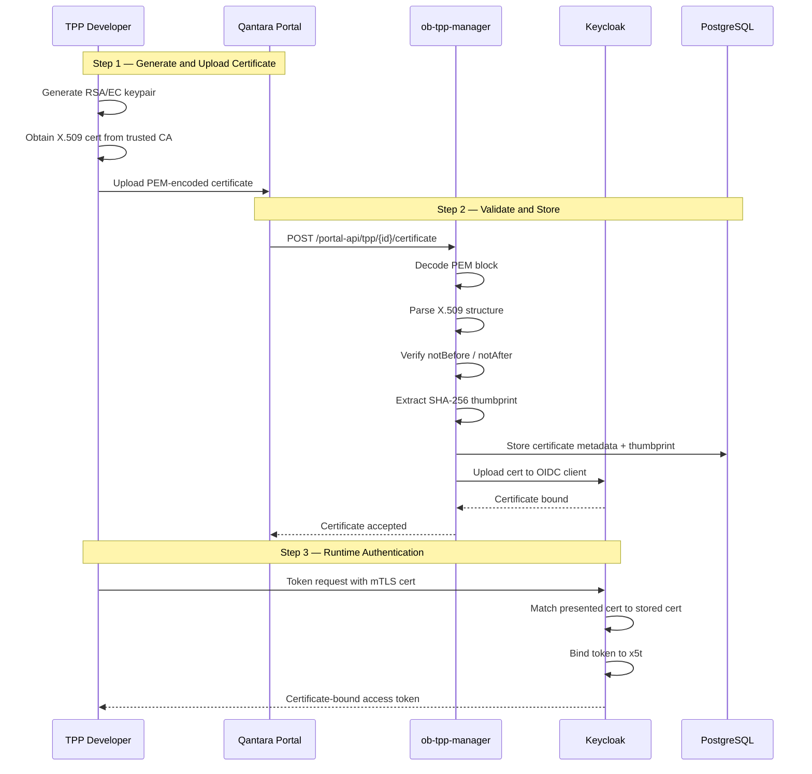
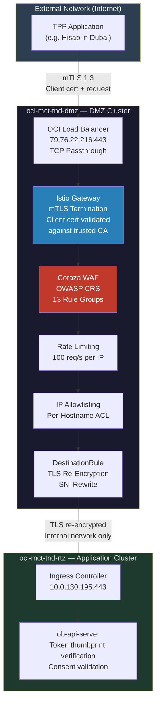

# Transport Security — mTLS Authentication for Third-Party Providers

This document describes how Third-Party Providers (TPPs) authenticate to the Qantara Open Banking platform using mutual TLS (mTLS) client certificates, and how access tokens are cryptographically bound to those certificates to prevent token theft.

## TPP Authentication Architecture

Every TPP — whether a fintech in Dubai, a payment processor in Riyadh, or an e-commerce platform in Bahrain — authenticates to Qantara through the same security chain: **mTLS client certificate at the DMZ gateway, followed by Keycloak FAPI 2.0 OAuth2 token exchange with certificate-bound access tokens**.



## Registered TPP Applications

Each TPP is registered as an independent external entity with its own client certificate, OAuth2 credentials, and role-based permissions. The mock merchant storefronts demonstrate real-world TPP integration patterns:

| TPP Application | Role | Public Endpoint | Use Case |
|---|---|---|---|
| **BD Online** | PISP | `banking-api.omtd.bankdhofar.com` | Online banking payment initiation |
| **Hisab** | PISP | `hisab-api.omtd.bankdhofar.com` | Accounting platform payments |
| **Masroofi** | PISP | `masroofi-api.omtd.bankdhofar.com` | Digital wallet top-up |
| **Sadad** | PISP | `sadad-api.omtd.bankdhofar.com` | Bill payment processing |
| **Salalah Electronics** | PISP | `salalah-api.omtd.bankdhofar.com` | E-commerce checkout |

All TPP traffic enters exclusively through the DMZ cluster at `79.76.22.216:443`. There is no direct access to the application cluster from the internet.

## mTLS Authentication Flow

The complete authentication chain has three levels: transport-level mTLS, token exchange with certificate binding, and consent-scoped API access.



### Level 1 — mTLS at DMZ Gateway (Transport Authentication)

The Istio Gateway in the DMZ cluster operates in `tls.mode: MUTUAL`, requiring every TPP to present a valid X.509 client certificate during the TLS handshake. The connection is rejected before any HTTP traffic is processed if the certificate is missing, expired, or not signed by a trusted CA.

```yaml
# Istio Gateway — mTLS mode
apiVersion: gateway.networking.k8s.io/v1
kind: Gateway
metadata:
  name: qantara-gateway
  namespace: istio-ingress
spec:
  listeners:
    - name: https-mtls
      port: 443
      protocol: HTTPS
      tls:
        mode: Mutual
        certificateRefs:
          - name: tls-omtd-bankdhofar-com
        clientValidation:
          caCertificateRefs:
            - name: tpp-trusted-ca-bundle
```

| Property | Value |
|---|---|
| TLS Version | 1.3 (minimum enforced) |
| Server Certificate | `*.omtd.bankdhofar.com` (Let's Encrypt, auto-renewed) |
| Client Certificate | Required — TPP must present valid X.509 cert |
| CA Validation | TPP cert must chain to a CA in `tpp-trusted-ca-bundle` |
| Termination Point | Istio Gateway in DMZ cluster |
| Failure Mode | Connection rejected at TLS layer (no HTTP response) |

### Level 2 — Certificate-Bound Access Tokens (FAPI 2.0)

After the mTLS handshake succeeds, the TPP authenticates to Keycloak to obtain an access token. Keycloak binds the token to the TPP's certificate thumbprint, creating a cryptographic link between the transport credential and the bearer token.



The Keycloak OIDC client for each TPP is configured with FAPI 2.0 security profile:

| Setting | Value | Purpose |
|---|---|---|
| `tls.client.certificate.bound.access.tokens` | `true` | Binds every token to the presenting cert |
| `pkce.code.challenge.method` | `S256` | PKCE with SHA-256 challenge |
| `token.endpoint.auth.signing.alg` | `PS256` | RSA-PSS with SHA-256 |
| `id.token.signed.response.alg` | `PS256` | Signed ID tokens |
| `require.pushed.authorization.requests` | `true` | PAR required |
| Token lifetime | 3600 seconds | 1 hour maximum |

This means **a stolen access token is useless** — the attacker cannot present the matching client certificate because they do not possess the TPP's private key.

### Level 3 — Consent-Scoped API Access

Even with a valid certificate-bound token, the TPP can only access data the customer has explicitly consented to. The `ob-api-server` validates three things on every request:



## TPP Certificate Lifecycle

The `ob-tpp-manager` service manages the full lifecycle of TPP client certificates, from upload through validation to Keycloak binding.



### Certificate Validation (ob-tpp-manager)

The certificate manager (`internal/certs/manager.go`) performs strict validation on every uploaded certificate:

| Check | Failure Condition | Error |
|---|---|---|
| PEM decode | No valid PEM block found | Rejected |
| Block type | Type is not `CERTIFICATE` | Rejected |
| X.509 parse | Malformed ASN.1 structure | Rejected |
| Not before | Current time before `notBefore` | Rejected — cert not yet valid |
| Not after | Current time after `notAfter` | Rejected — cert expired |
| Thumbprint | SHA-256 of DER-encoded cert | Extracted and stored |

### Certificate Management API

| Endpoint | Method | Purpose |
|---|---|---|
| `/portal-api/tpp/{id}/certificate` | `POST` | Upload PEM-encoded X.509 client certificate |
| `/portal-api/tpp/{id}/certificate` | `GET` | Retrieve certificate metadata and thumbprint |

## End-to-End Request Path

A complete API request from a TPP traverses the following security layers:



### TLS Segments

There are three distinct TLS segments in the request path. At no point does traffic travel unencrypted between clusters.

| Segment | From | To | Protocol | Purpose |
|---|---|---|---|---|
| 1 | TPP (internet) | DMZ Istio Gateway | mTLS 1.3 | Client certificate authentication |
| 2 | DMZ DestinationRule | TND Ingress Controller | TLS (re-encrypted) | Secure internal forwarding |
| 3 | TND Ingress | Application pods | Istio auto-mTLS | Encrypted mesh traffic |

**Segment 1 — mTLS from TPP to DMZ**: The TPP presents its client certificate. The Istio Gateway validates the certificate chain against the trusted CA bundle and terminates TLS. The Coraza WAF inspects the decrypted HTTP request.

**Segment 2 — Re-encryption to TND**: The DMZ DestinationRule establishes a new TLS connection to the TND ingress controller with SNI rewrite, ensuring traffic between clusters is always encrypted.

```yaml
# DestinationRule — TLS re-encryption from DMZ to TND
apiVersion: networking.istio.io/v1
kind: DestinationRule
spec:
  host: tnd-nginx-ingress-banking.istio-ingress.svc.cluster.local
  trafficPolicy:
    tls:
      mode: SIMPLE
      sni: banking.tnd.bankdhofar.com
```

**Segment 3 — Mesh encryption within TND**: All application pods run with Istio sidecar proxy. Pod-to-pod traffic is automatically encrypted with mTLS using short-lived, auto-rotated certificates issued by Istiod (mesh CA), enforcing TLS 1.3 as the minimum protocol version.

## Security Properties Summary

| Property | Implementation |
|---|---|
| **TPP Identity** | X.509 client certificate, validated at DMZ gateway |
| **Token Binding** | Access token bound to cert thumbprint (x5t#S256 via FAPI 2.0) |
| **Token Theft Protection** | Stolen token unusable without corresponding private key |
| **Transport Encryption** | TLS 1.3 enforced on all segments, no plaintext anywhere |
| **Request Inspection** | Coraza WAF with full OWASP CRS after mTLS termination |
| **Consent Enforcement** | Every API call validated against customer consent scope |
| **Certificate Validation** | PEM parsing, X.509 verification, expiry checking, thumbprint extraction |
| **Key Algorithm** | PS256 (RSA-PSS with SHA-256) for all token signatures |
| **PKCE** | S256 challenge method required |
| **Certificate Rotation** | TPP uploads new cert via portal, Keycloak binding updated |
| **Mesh Encryption** | Istio auto-mTLS with TLS 1.3, 24h certificate rotation |
