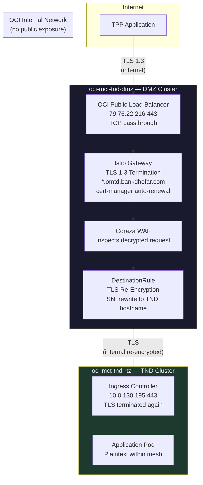
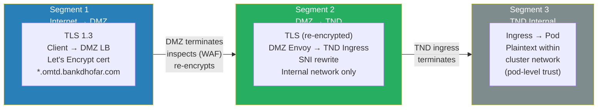
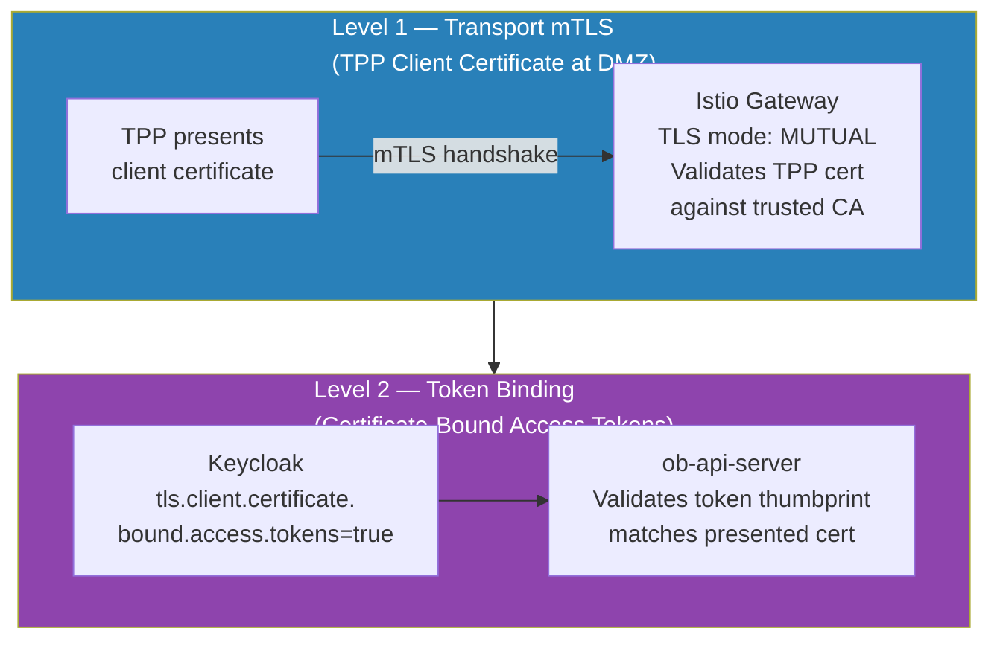
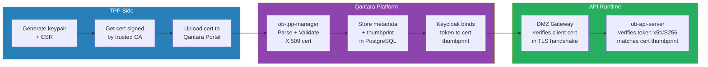

# Transport Security — mTLS and TLS Architecture

This document describes the transport security model for the Qantara Open Banking platform, covering TLS termination, re-encryption between clusters, mTLS for TPP authentication, and the certificate lifecycle.

## TLS Architecture Overview



## TLS Segments

There are **three distinct TLS segments** in the request path. At no point does traffic travel unencrypted between clusters.



### Segment 1 — Internet to DMZ (TLS 1.3)

| Property | Value |
|---|---|
| Protocol | TLS 1.3 |
| Certificate | `*.omtd.bankdhofar.com` (wildcard) |
| Issuer | Let's Encrypt (ACME) |
| Management | cert-manager with auto-renewal |
| Secret | `tls-omtd-bankdhofar-com` in `istio-ingress` namespace |
| Termination Point | Istio Gateway (`ingressgateway`) in DMZ cluster |

The Istio Gateway terminates TLS, allowing the Coraza WAF (running in-process as a Wasm plugin) to inspect the decrypted HTTP request against the full OWASP Core Rule Set.

### Segment 2 — DMZ to TND (TLS Re-Encryption)

| Property | Value |
|---|---|
| Protocol | TLS (SIMPLE mode) |
| Initiated by | Istio DestinationRule in DMZ cluster |
| SNI | Rewritten to target TND hostname (e.g., `banking.tnd.bankdhofar.com`) |
| Host Header | Rewritten via HTTPRoute RequestHeaderModifier |
| Target | TND `ingress-nginx-controller` at `10.0.130.195:443` |
| Network | OCI internal — not routable from the internet |

```yaml
# DestinationRule — TLS re-encryption from DMZ to TND
apiVersion: networking.istio.io/v1
kind: DestinationRule
spec:
  host: tnd-nginx-ingress-banking.istio-ingress.svc.cluster.local
  trafficPolicy:
    tls:
      mode: SIMPLE
      sni: banking.tnd.bankdhofar.com
```

Traffic is re-encrypted before leaving the DMZ cluster. The DestinationRule establishes a new TLS connection to the TND ingress controller with the correct SNI, ensuring the TND ingress can route the request to the correct backend service.

### Segment 3 — TND Internal (Ingress to Pod)

Within the TND cluster, the ingress controller terminates TLS and forwards plaintext HTTP to the application pods over the internal cluster network. This is standard Kubernetes ingress behavior.

## mTLS — Mutual TLS for TPP Authentication

### Current State (Sandbox)

In the current sandbox deployment, TPP authentication uses **OAuth2 client credentials** (client_id + client_secret) via Keycloak. The Keycloak realm (`open-banking`) is configured with:

| Setting | Value | Purpose |
|---|---|---|
| `defaultSignatureAlgorithm` | PS256 | FAPI-compliant JWT signing |
| `pkce.code.challenge.method` | S256 | Proof Key for Code Exchange |
| `accessTokenLifespan` | 3600s | 1-hour token validity |

### mTLS Readiness (Production Path)

The platform is architecturally ready for mTLS enforcement at two levels:



#### Level 1 — Transport mTLS (Client Certificate Verification)

The Istio Gateway in the DMZ cluster supports `tls.mode: MUTUAL`, which requires TPPs to present a valid client certificate during the TLS handshake. This is configured by changing the Gateway resource:

```yaml
# Gateway — mTLS mode (production)
spec:
  listeners:
    - name: https
      port: 443
      protocol: HTTPS
      tls:
        mode: Terminate          # current: server-only TLS
        # mode: Mutual           # production: requires client cert
        certificateRefs:
          - name: tls-omtd-bankdhofar-com
        # clientValidation:      # production: trusted CA for TPP certs
        #   caCertificateRefs:
        #     - name: tpp-trusted-ca
```

#### Level 2 — Certificate-Bound Access Tokens (FAPI)

When mTLS is enabled, access tokens are bound to the TPP's client certificate thumbprint. The OBIE/FAPI specification requires that:

1. The TPP authenticates to Keycloak using mTLS (certificate + client_id)
2. Keycloak binds the access token to the certificate thumbprint (`x5t#S256`)
3. On every API call, `ob-api-server` verifies the presented certificate matches the token's thumbprint

This prevents token theft — a stolen token is useless without the corresponding private key.

#### TPP Certificate Management

The `ob-tpp-manager` service already implements certificate handling:

| Endpoint | Purpose |
|---|---|
| `POST /portal-api/tpp/{id}/certificate` | Upload PEM-encoded X.509 client certificate |
| `GET /portal-api/tpp/{id}/certificate` | Retrieve certificate metadata |

The certificate manager (`internal/certs/manager.go`) performs:
- PEM block parsing and validation
- X.509 structure verification
- Expiry checking (notBefore / notAfter)
- SHA-256 thumbprint extraction (used for token binding)

## Certificate Lifecycle



## Summary of Transport Security Controls

| Layer | Current (Sandbox) | Production (Planned) |
|---|---|---|
| Internet → DMZ | TLS 1.3, server cert only | TLS 1.3 + mTLS (client cert required) |
| DMZ → TND | TLS re-encryption (SIMPLE) | TLS re-encryption (SIMPLE) |
| TND internal | Plaintext (cluster network) | Plaintext (cluster network) |
| Token auth | OAuth2 client_credentials (secret) | OAuth2 + certificate-bound tokens |
| JWT signing | PS256 | PS256 |
| PKCE | S256 | S256 |
| Token lifetime | 3600s | Configurable per TPP |
| Certificate upload | Supported (ob-tpp-manager) | Required for all TPPs |
