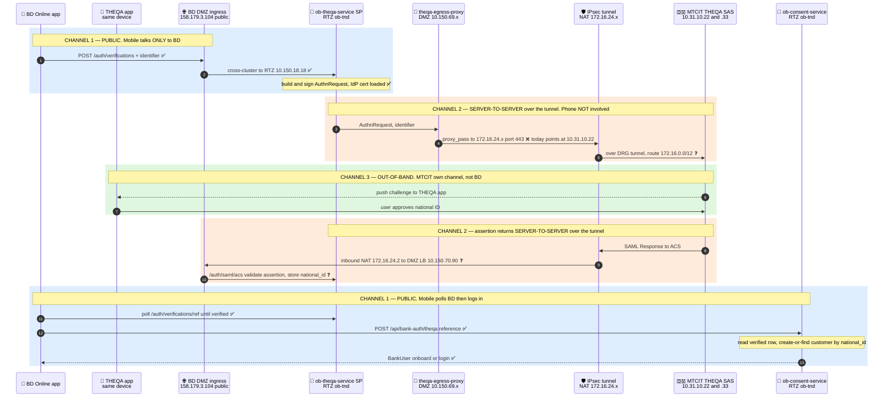
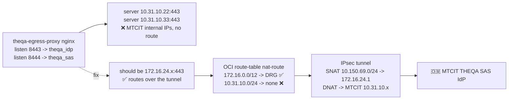

# THEQA Integration — Traffic Flow (Intended vs Working)

**Date:** 2026-06-08 · **Issue:** #15 (builds on #4) · **App:** Bank Dhofar Online (`bd-online-mobile`)

THEQA = MTCIT national digital identity (SAS platform, SAML 2.0). Bank Dhofar is the SAML SP
(`ob-theqa-service`).

> **Key correction:** the mobile device is on the public internet and **cannot** reach the
> internal/NAT IPs (`172.16.24.x`, `10.31.10.x`) — those exist only inside the BD↔MTCIT IPsec
> tunnel. So the phone **never** talks to MTCIT. There are **three separate channels:**
>
> 1. **Public** — mobile ↔ BD DMZ ingress (`158.179.3.104`): start, poll, login.
> 2. **Server-to-server over the tunnel** — BD SP backend ↔ MTCIT IdP backend: the AuthnRequest
>    out, and the SAML assertion back to ACS. Backend-to-backend only.
> 3. **Out-of-band** — the user approves in the **THEQA app**, which talks to **MTCIT directly**
>    over MTCIT's own channel (not BD's tunnel, not via BD).

Legend: ✅ working &nbsp; ❌ broken &nbsp; ❓ untested (blocked upstream)

---

## 1. Intended end-to-end flow (three channels)

---

## 2. Status by leg

| # | Channel | Leg | IPs / ports | Status |
|---|---------|-----|-------------|--------|
| 1 | Public | App → DMZ ingress → SP `/auth/verifications` | `158.179.3.104` → RTZ `10.150.18.18` | ✅ working |
| 1 | Public | SP builds + signs AuthnRequest | SP key + **IdP cert loaded** | ✅ working |
| 2 | Tunnel (s2s) | SP → egress proxy → MTCIT IdP **(outbound)** | proxy `:8443` → **`10.31.10.22:443`** | ❌ **BROKEN** |
| 3 | Out-of-band | MTCIT pushes to THEQA app, user approves | MTCIT ↔ device | — MTCIT side |
| 4 | Tunnel (s2s) | MTCIT IdP → ACS **(inbound)** | `172.16.24.2` → `10.150.70.90` → `/auth/saml/acs` | ❓ untested |
| 5 | Public | App polls verification result | RTZ SP | ✅ ready |
| 6 | Public | App → consent-svc `/bank-auth/theqa` → create-or-find customer | RTZ `ob-consent-service` | ✅ verified live |

**Leg 4 explained:** the phone is not in this path. Once the user approves in the THEQA app
(channel 3), MTCIT's IdP server posts the signed SAML assertion to BD's ACS **over the tunnel**
(inbound NAT `172.16.24.2` → DMZ ingress LB `10.150.70.90` → SP `/auth/saml/acs`). The SP records
`national_id` against the `reference`; the phone only finds out by **polling BD** (leg 5).

---

## 3. Where it breaks — the egress destination

---

## 4. IP / endpoint reference

| Component | Address | Channel | Role |
|---|---|---|---|
| BD Online app (mobile) | client device | public | starts + polls + logs in, talks only to BD |
| THEQA app (mobile) | same device | out-of-band | user approves, talks to MTCIT directly |
| BD DMZ public ingress | `158.179.3.104` | public | host `qantara-api.omtd.bankdhofar.com` |
| RTZ ingress (cross-cluster) | `10.150.18.18` | public | DMZ → RTZ bridge |
| `ob-theqa-service` (SAML SP) | RTZ `oci-mct-tnd-rtz` / `ob-tnd` | both | AuthnRequest out, ACS `/auth/saml/{acs,sls}` in |
| `ob-consent-service` | RTZ `oci-mct-tnd-rtz` / `ob-tnd` | public | `/bank-auth/theqa` create-or-find customer |
| `theqa-egress-proxy` (nginx) | DMZ `oci-mct-tnd-dmz` / `theqa-egress`, nodes `10.150.69.x` | tunnel | outbound to MTCIT, `:8443`→IdP, `:8444`→SAS |
| BD **source** NAT | `172.16.24.1` | tunnel | how BD appears to MTCIT |
| BD **inbound** NAT | `172.16.24.2` | tunnel | MTCIT → BD DMZ ingress LB |
| DMZ ingress LB (ACS inbound) | `10.150.70.90` | tunnel | SAML Response POST target |
| OCI route (tunnel) | `172.16.0.0/12 → DRG` | tunnel | the only path to MTCIT |
| MTCIT THEQA IdP (SSO) | `10.31.10.22:443` | tunnel | `SingleSignOnService` |
| MTCIT THEQA SAS | `10.31.10.33:443` | tunnel | metadata / additional SAS |
| MTCIT **destination** NAT | `172.16.24.X` ← **UNKNOWN** | tunnel | what the egress proxy must dial for the two above |

---

## 5. Open items

1. **Exact `172.16.24.X`** the egress proxy must target for the IdP (`10.31.10.22`) and SAS
   (`10.31.10.33`). Probed `.1–.4 / .10–.12 / .22 / .33` from the DMZ — none answered.
2. Whether the **tunnel passes application traffic** yet (the 6-day-old "no return packets").
3. **App-code note:** because BD↔MTCIT is server-to-server (channel 2) and the human auth is the
   THEQA app (channel 3), the app should **not** open the IdP URL itself — it starts the
   verification and polls. The exact THEQA-app trigger (push vs deep-link) to confirm with MTCIT/Asma.

**Next action:** once the two `172.16.24.X` IPs are confirmed, repoint `theqa-proxy-conf`
upstreams, restart `theqa-egress-proxy`, re-probe. Answer → leg 2 up; no answer → tunnel
(Network: Sudheer / MTCIT: Manal).
