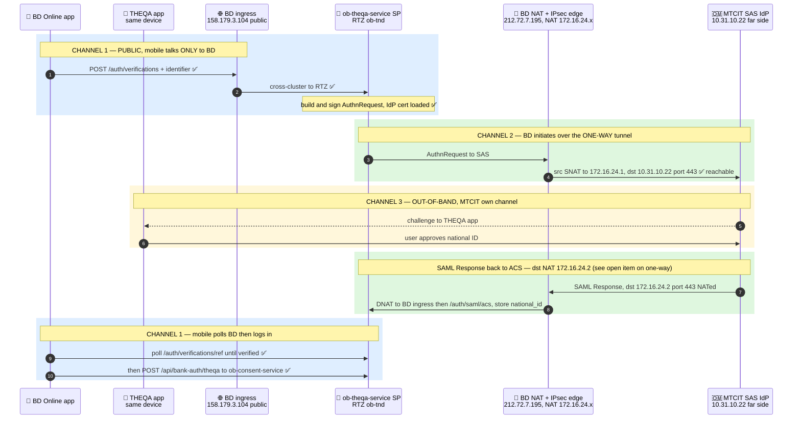
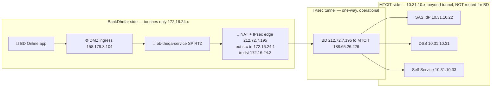

# THEQA Integration — Traffic Flow

**Date:** 2026-06-09 · **Issue:** #15 (builds on #4) · **App:** Bank Dhofar Online (`bd-online-mobile`)
**Authoritative source:** full email chain `RE_ Introductory Discussion - THEQA.msg`, latest =
**Manal Al-Ajmi (MTCIT), 2026-06-03**.

> **Network facts confirmed by MTCIT (2026-06-03):** the IPsec S2S tunnel
> (BD `212.72.7.195` ↔ MTCIT `188.65.26.226`) is **operational, one-way** (BD initiates).
> **All three Theqa destinations are now reachable.** BD's source is NAT'd to `172.16.24.1`.
>
> **BD only ever touches `172.16.24.x` (the NAT).** `10.31.10.x` live on MTCIT's side, beyond the
> tunnel — they are **not routed for BD** and cannot be dialed/tested from BD directly.

| MTCIT service (far side, beyond tunnel) | IP | BD touch point (NAT) |
|---|---|---|
| **SAS** — Strong Authentication Service (the SAML **IdP**) | `10.31.10.22:443` | outbound, src NAT **`172.16.24.1`** |
| **DSS** — Digital Signature Service | `10.31.10.31:443` | outbound, src NAT **`172.16.24.1`** |
| **Self-Service** | `10.31.10.33:443` | outbound, src NAT **`172.16.24.1`** |
| **ACS** — SAML Response POST back to BD | (MTCIT `10.31.10.0/24`) | inbound, dst NAT **`172.16.24.2:443`** |

Three channels: **Public** (mobile ↔ BD), **Tunnel/NAT s2s** (BD NAT ↔ MTCIT), **Out-of-band**
(THEQA app ↔ MTCIT). The mobile never touches MTCIT or `10.31.10.x`.

---

## 1. Intended end-to-end flow

---

## 2. Network topology — who touches what

---

## 3. Status by leg

| # | Channel | Leg | Address | Status |
|---|---------|-----|---------|--------|
| 1 | Public | App → DMZ ingress → SP `/auth/verifications` | `158.179.3.104` | ✅ working |
| 1 | Public | SP builds + signs AuthnRequest | SP key + IdP cert loaded | ✅ working |
| 2 | Tunnel | BD → SAS IdP (outbound, NAT) | src `172.16.24.1` → SAS `10.31.10.22:443` | ✅ MTCIT: reachable |
| 3 | Out-of-band | THEQA app ↔ MTCIT, user approves | device ↔ MTCIT | — MTCIT side |
| 4 | Tunnel | MTCIT → BD ACS (inbound, NAT) | dst `172.16.24.2:443` → ACS | ⚠️ see open item (one-way) |
| 5 | Public | App polls result, then `/bank-auth/theqa` | RTZ SP + `ob-consent-service` | ✅ ready / verified |

**I am not claiming any connection failure.** MTCIT confirmed all 3 destinations reachable
(2026-06-03). Earlier "timeouts" I reported were invalid tests — I dialed `10.31.10.x` from an
OKE pod that is **not** NAT'd to `172.16.24.1`, so it could never reach MTCIT. Only properly-NAT'd
traffic does.

---

## 4. Open items (application / config — not network)

1. **One-way tunnel vs inbound ACS.** The tunnel is **BD-initiated one-way**. The outbound
   AuthnRequest to SAS (`10.31.10.22`) works. The **SAML Response to ACS** is drawn as an inbound
   POST to `172.16.24.2` — confirm with MTCIT whether the assertion returns **synchronously on the
   BD-initiated connection** (works over one-way) or needs the **reverse direction** enabled
   (MTCIT asked BD for "the correct source IP/subnet" for `10.31.10.0/24 → 172.16.24.2`).
2. **ACS hostname.** SP advertises `qantara-api.omtd.bankdhofar.com/auth/saml/acs` (config +
   registration email); the matrix names `theqa.omtd.bankdhofar.com`. Confirm which MTCIT uses, and
   that `172.16.24.2` DNATs to the BD ingress serving it.
3. **SP egress must source via the NAT.** The SP's MTCIT-bound traffic has to leave BD through the
   path that SNATs to `172.16.24.1` — verify the SP/egress routing actually takes that path.
4. **CTA.** MTCIT SAML is "secured by Crypto Token Agent (CTA)" — confirm whether the SP must
   integrate the CTA in addition to standard SAML 2.0.
5. **Other Theqa services available on the tunnel:** **DSS** (`10.31.10.31`, digital signing) and
   **Self-Service** (`10.31.10.33`) — both reachable; candidates for later phases.
