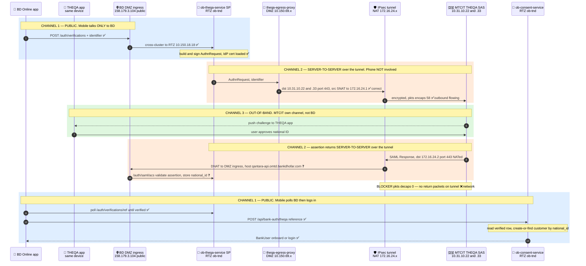
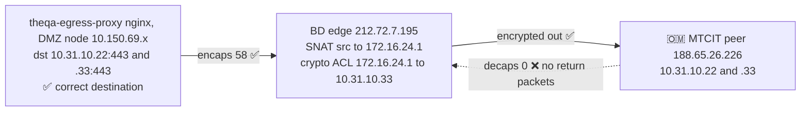

# THEQA Integration — Traffic Flow (Intended vs Working)

**Date:** 2026-06-08 · **Issue:** #15 (builds on #4) · **App:** Bank Dhofar Online (`bd-online-mobile`)

THEQA = MTCIT national digital identity (SAS platform, SAML 2.0). Bank Dhofar is the SAML SP
(`ob-theqa-service`).

> **Key correction:** the mobile device is on the public internet and **cannot** reach the
> internal/NAT IPs (`172.16.24.x`, `10.31.10.x`) — those exist only inside the BD↔MTCIT IPsec
> tunnel. So the phone **never** talks to MTCIT. There are **three separate channels:**
>
> 1. **Public** — mobile ↔ BD DMZ ingress (`158.179.3.104`): start, poll, login.
> 2. **Server-to-server over the tunnel** — BD SP backend ↔ MTCIT IdP backend: the AuthnRequest
>    out, and the SAML assertion back to ACS. Backend-to-backend only.
> 3. **Out-of-band** — the user approves in the **THEQA app**, which talks to **MTCIT directly**
>    over MTCIT's own channel (not BD's tunnel, not via BD).

Legend: ✅ working &nbsp; ❌ broken &nbsp; ❓ untested (blocked upstream)

---

## 1. Intended end-to-end flow (three channels)

---

## 2. Status by leg

| # | Channel | Leg | IPs / ports | Status |
|---|---------|-----|-------------|--------|
| 1 | Public | App → DMZ ingress → SP `/auth/verifications` | `158.179.3.104` → RTZ `10.150.18.18` | ✅ working |
| 1 | Public | SP builds + signs AuthnRequest | SP key + **IdP cert loaded** | ✅ working |
| 2 | Tunnel (s2s) | SP → egress → MTCIT **(outbound)** | dst `10.31.10.22/.33:443`, src NAT `172.16.24.1` | ✅ `encaps 58` flowing |
| 3 | Out-of-band | MTCIT pushes to THEQA app, user approves | MTCIT ↔ device | — MTCIT side |
| 4 | Tunnel (s2s) | MTCIT → BD ACS **(inbound)** | dst `172.16.24.2:443` NAT → ACS `qantara-api.omtd` | ❌ **`decaps 0` no return** |
| 5 | Public | App polls verification result | RTZ SP | ✅ ready |
| 6 | Public | App → consent-svc `/bank-auth/theqa` → create-or-find customer | RTZ `ob-consent-service` | ✅ verified live |

**Leg 4 explained:** the phone is not in this path. Once the user approves in the THEQA app
(channel 3), MTCIT's IdP server posts the signed SAML assertion to BD's ACS **over the tunnel** —
MTCIT dials the NATed address **`172.16.24.2:443`**, which DNATs to the BD ingress serving the ACS
host (our SP advertises `qantara-api.omtd.bankdhofar.com/auth/saml/acs`). The SP records
`national_id` against the `reference`; the phone only finds out by **polling BD** (leg 5).

---

## 3. Where it breaks — the tunnel return path (not the egress IP)

The egress proxy targets the **correct** MTCIT sockets. The Cisco crypto-map dump from the Network
email proves the destination is the real `10.31.10.x`, the source is NATed to `172.16.24.1`,
outbound is flowing (`encaps 58`) — and **nothing returns** (`decaps 0`). The blocker is the
tunnel **return path**, not any IP we control.

---

## 4. IP / endpoint reference

| Component | Address | Channel | Role |
|---|---|---|---|
| BD Online app (mobile) | client device | public | starts + polls + logs in, talks only to BD |
| THEQA app (mobile) | same device | out-of-band | user approves, talks to MTCIT directly |
| BD DMZ public ingress | `158.179.3.104` | public | host `qantara-api.omtd.bankdhofar.com` |
| RTZ ingress (cross-cluster) | `10.150.18.18` | public | DMZ → RTZ bridge |
| `ob-theqa-service` (SAML SP) | RTZ `oci-mct-tnd-rtz` / `ob-tnd` | both | AuthnRequest out, ACS `/auth/saml/{acs,sls}` in |
| `ob-consent-service` | RTZ `oci-mct-tnd-rtz` / `ob-tnd` | public | `/bank-auth/theqa` create-or-find customer |
| `theqa-egress-proxy` (nginx) | DMZ `oci-mct-tnd-dmz` / `theqa-egress`, nodes `10.150.69.x` | tunnel | outbound to MTCIT, `:8443`→IdP, `:8444`→SAS |
| BD **outbound source** NAT | `172.16.24.1` | tunnel | how BD appears to MTCIT (crypto-map local ident) |
| BD **inbound dest** NAT | `172.16.24.2:443` | tunnel | what MTCIT dials for the ACS, DNATs to the BD ingress |
| DMZ ingress LB (ACS DNAT target) | `10.150.70.90` | tunnel | internal target serving the ACS host |
| OCI route (tunnel) | `172.16.0.0/12 → DRG` | tunnel | path to MTCIT (and the 172.16.24.x NATs) |
| MTCIT THEQA IdP (SSO) | `10.31.10.22:443` | tunnel | `SingleSignOnService` — proxy `theqa_idp` (correct) |
| MTCIT THEQA SAS | `10.31.10.33:443` | tunnel | metadata / SAS — proxy `theqa_sas` (correct) |
| IPsec peers | BD `212.72.7.195` ↔ MTCIT `188.65.26.226` | tunnel | crypto-map endpoints |

There is **no unknown destination IP** — outbound dials the real `10.31.10.x` (source-NAT `.1`),
inbound is `.2`. Both 172 addresses are known.

---

## 5. Open items

1. **Tunnel return path (the actual blocker).** Crypto-map shows `pkts encaps 58 / decaps 0` —
   BD encrypts and sends, MTCIT returns nothing ("no return packets on tunnel for all 3
   destinations"). Owners: **Network (Sudheer)** + **MTCIT (Manal / Kadir)**. MTCIT also asked BD
   for "the correct source IP/subnet" to allow — i.e. `172.16.24.1`.
2. **ACS hostname mismatch to confirm.** Our SP advertises ACS at `qantara-api.omtd.bankdhofar.com`
   (SP config + the registration email), but the traffic-matrix inbound row names
   `theqa.omtd.bankdhofar.com` (which is **not** configured in the DMZ). Confirm with MTCIT which
   host they POST to, and ensure `172.16.24.2` DNATs to the ingress serving it.
3. **App-code note:** because BD↔MTCIT is server-to-server (channel 2) and the human auth is the
   THEQA app (channel 3), the app should **not** open the IdP URL itself — it starts the
   verification and polls. The exact THEQA-app trigger (push vs deep-link) to confirm with MTCIT/Asma.

**Next action:** the egress destination is correct — nothing to change on our side for leg 2.
The blocker is the tunnel return path (`decaps 0`), owned by Network + MTCIT. In parallel, resolve
the ACS-hostname mismatch (item 2).
