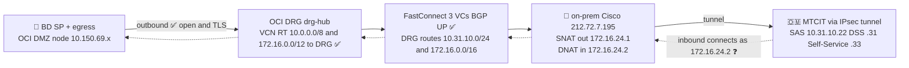

# THEQA Integration — Traffic Flow

**Date:** 2026-06-09 · **Issue:** #15 (builds on #4) · **App:** Bank Dhofar Online (`bd-online-mobile`)
**Authoritative source:** full email chain `RE_ Introductory Discussion - THEQA.msg`, latest =
**Manal Al-Ajmi (MTCIT), 2026-06-03**.

> **Network facts confirmed by MTCIT (2026-06-03):** the IPsec S2S tunnel
> (BD `212.72.7.195` ↔ MTCIT `188.65.26.226`) is **operational, one-way** (BD initiates).
> **All three Theqa destinations are now reachable.** BD's source is NAT'd to `172.16.24.1`.
>
> **BD only ever touches `172.16.24.x` (the NAT).** `10.31.10.x` live on MTCIT's side, beyond the
> tunnel — they are **not routed for BD** and cannot be dialed/tested from BD directly.

| MTCIT service (far side, beyond tunnel) | IP | BD touch point (NAT) |
|---|---|---|
| **SAS** — Strong Authentication Service (the SAML **IdP**) | `10.31.10.22:443` | outbound, src NAT **`172.16.24.1`** |
| **DSS** — Digital Signature Service | `10.31.10.31:443` | outbound, src NAT **`172.16.24.1`** |
| **Self-Service** | `10.31.10.33:443` | outbound, src NAT **`172.16.24.1`** |
| **ACS** — SAML Response POST back to BD | (MTCIT `10.31.10.0/24`) | inbound, dst NAT **`172.16.24.2:443`** |

Three channels: **Public** (mobile ↔ BD), **Tunnel/NAT s2s** (BD NAT ↔ MTCIT), **Out-of-band**
(THEQA app ↔ MTCIT). The mobile never touches MTCIT or `10.31.10.x`.

---

## 1. Intended end-to-end flow

```mermaid
sequenceDiagram
    autonumber
    participant App as 📱 BD Online app
    participant THQ as 📲 THEQA app<br>same device
    participant ING as 🌐 BD ingress<br>158.179.3.104 public
    participant SP as 🔐 ob-theqa-service SP<br>RTZ ob-tnd
    participant NAT as 🔁 BD NAT + IPsec edge<br>212.72.7.195, NAT 172.16.24.x
    participant IDP as 🇴🇲 MTCIT SAS IdP<br>10.31.10.22 far side

    rect rgb(223,238,255)
    Note over App,ING: CHANNEL 1 — PUBLIC, mobile talks ONLY to BD
    App->>ING: GET /auth/saml/metadata and /health  ✅ OK 200
    App->>ING: POST /auth/verifications  ✅ OK 201 builds signed SAMLRequest
    Note over SP: python-multipart added; AuthnRequest signed, redirect targets stg-idp-pki.mtcit.gov.om ✅
    end

    rect rgb(223,247,223)
    Note over SP,IDP: CHANNEL 2 — BD initiates over the tunnel
    SP->>NAT: AuthnRequest to SAS
    NAT->>IDP: dst 10.31.10.22 port 443  ✅ OK port open + TLSv1.3 handshake from DMZ
    Note over NAT,IDP: all 3 dests OPEN and TLS negotiated, after on-prem Cisco NAT fix
    end

    rect rgb(255,247,219)
    Note over THQ,IDP: CHANNEL 3 — OUT-OF-BAND, MTCIT own channel  ❓ NOT TESTED
    IDP-->>THQ: challenge to THEQA app
    THQ->>IDP: user approves national ID
    end

    rect rgb(255,224,224)
    Note over IDP,SP: CHANNEL 2 inbound — MTCIT connects as 172.16.24.2 (mirror of outbound)
    IDP->>NAT: SAML Response POST, src 10.31.10.x dst 172.16.24.2 port 443  ❓ NOT TESTED, cannot originate
    NAT->>SP: DNAT to ingress 10.150.70.90 then host then /auth/saml/acs
    Note over SP: python-multipart fixed; ACS parses a real assertion ✅<br>confirm 172.16.24.2 to 10.150.70.90 routes the ACS host to the SP
    end

    rect rgb(223,238,255)
    Note over App,SP: CHANNEL 1 — mobile polls BD then logs in
    App->>SP: GET /auth/verifications/ref  ✅ OK 404 on unknown
    App->>SP: POST /api/bank-auth/theqa  ✅ OK 404 on unknown
    end
```

---

## 2. Network topology — who touches what



---

## 3. Status by leg

Legend: **OK** = I tested it and it works · **FAILED** = I tested it and it fails ·
**NOT TESTED** = I cannot originate this traffic (e.g. THEQA→us, or traffic that must be sourced
as the `172.16.24.1` NAT).

| # | Channel | Leg | What I ran (2026-06-09) | Result |
|---|---------|-----|-------------------------|--------|
| 1a | Public | Ingress → SP reachability | `GET /auth/saml/metadata`, `/health` via `158.179.3.104` | **OK** — `200` |
| 1b | Public | Start verification / build AuthnRequest | `POST /auth/verifications` via ingress | **OK** — `201`, signed `SAMLRequest` → `stg-idp-pki.mtcit.gov.om` (fixed by adding `python-multipart`) |
| 2 | Tunnel | BD → SAS/DSS/Self-Service (outbound) | `nc` + `curl` from DMZ to `10.31.10.22` / `.31` / `.33:443` | **OK** — all 3 **open + TLSv1.3 handshake** (after on-prem Cisco NAT fix; was timing out earlier) |
| 3 | Out-of-band | THEQA app ↔ MTCIT, user approves | — MTCIT side | **NOT TESTED** |
| 4 | Tunnel | MTCIT → BD ACS (inbound, THEQA-originated) | — cannot originate | **NOT TESTED** |
| 5 | Public | App polls verification result | `GET /auth/verifications/{ref}` via ingress | **OK** — `404` on unknown (healthy) |
| 6 | Public | App → consent `/bank-auth/theqa` | `POST /banking/bank-auth/theqa` (internal) | **OK** — `404` on unknown (healthy) |

**Bottom line of testing — both BD-side problems now resolved:**
1. **Internal SP bug — FIXED.** Added `python-multipart` (rev 23, `ob-theqa-service:c7184dc3`):
   `POST /auth/verifications` now `201` with a signed `SAMLRequest` to MTCIT, and `/auth/saml/acs`
   parses real assertions (only errored earlier on a dummy non-XML payload).
2. **BD egress to MTCIT — NOW WORKING.** From the DMZ, `nc` + `curl` to all 3 destinations
   (`10.31.10.22 / .31 / .33:443`) now return **port open + a completed TLSv1.3 handshake**
   (earlier they timed out). OCI routing was always correct (VCN → DRG → FastConnect, with
   `10.31.10.0/24` + `172.16.0.0/16` as DYNAMIC/BGP routes to the on-prem attachment); the gap
   was the **on-prem Cisco NAT/route for the OKE source subnet**, which the network team has fixed.

The inbound leg (MTCIT → ACS) and the out-of-band THEQA-app leg I genuinely cannot originate →
NOT TESTED.

---

## 4. Open items (application / config — not network)

0. **[BUG, tested] `POST /auth/verifications` → 500.** The SP container is missing
   `python-multipart`, so `saml.py:_request_payload` throws `AssertionError: The python-multipart
   library must be installed to use form parsing`. Fix: add `python-multipart` to
   `services/ob-theqa-service/requirements.txt`, rebuild via CI, redeploy. This blocks the start of
   the whole flow.
1. **One-way tunnel vs inbound ACS.** The tunnel is **BD-initiated one-way**. The outbound
   AuthnRequest to SAS (`10.31.10.22`) works. The **SAML Response to ACS** is drawn as an inbound
   POST to `172.16.24.2` — confirm with MTCIT whether the assertion returns **synchronously on the
   BD-initiated connection** (works over one-way) or needs the **reverse direction** enabled
   (MTCIT asked BD for "the correct source IP/subnet" for `10.31.10.0/24 → 172.16.24.2`).
2. **ACS hostname.** SP advertises `qantara-api.omtd.bankdhofar.com/auth/saml/acs` (config +
   registration email); the matrix names `theqa.omtd.bankdhofar.com`. Confirm which MTCIT uses, and
   that `172.16.24.2` DNATs to the BD ingress serving it.
3. **SP egress must source via the NAT.** The SP's MTCIT-bound traffic has to leave BD through the
   path that SNATs to `172.16.24.1` — verify the SP/egress routing actually takes that path.
4. **CTA.** MTCIT SAML is "secured by Crypto Token Agent (CTA)" — confirm whether the SP must
   integrate the CTA in addition to standard SAML 2.0.
5. **Other Theqa services available on the tunnel:** **DSS** (`10.31.10.31`, digital signing) and
   **Self-Service** (`10.31.10.33`) — both reachable; candidates for later phases.
