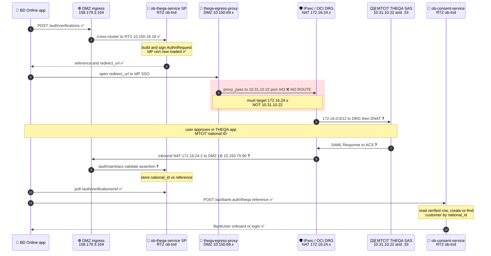
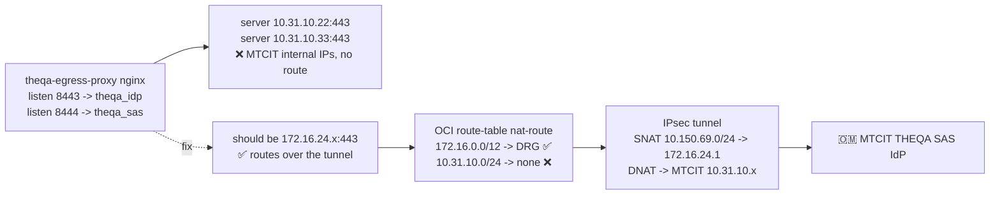

# THEQA Integration — Traffic Flow (Intended vs Working)

**Date:** 2026-06-08 · **Issue:** #15 (builds on #4) · **App:** Bank Dhofar Online (`bd-online-mobile`)

THEQA = MTCIT national digital identity (SAS platform, SAML 2.0). Bank Dhofar is the SAML SP
(`ob-theqa-service`). This document shows the intended end-to-end flow with IPs, and marks
each leg ✅ working / ❌ broken / ❓ untested.

Legend: ✅ working &nbsp; ❌ broken &nbsp; ❓ untested (blocked upstream)

---

## 1. Intended end-to-end flow (SP-initiated SAML)

---

## 2. Status by leg

| # | Leg | IPs / ports | Status |
|---|-----|-------------|--------|
| 1 | App → DMZ ingress → SP `/auth/verifications` | `158.179.3.104` → RTZ `10.150.18.18` | ✅ working |
| 1 | SP builds + signs AuthnRequest | SP key + **IdP cert now loaded** | ✅ working |
| 2 | SP/egress → MTCIT IdP **(outbound)** | proxy `:8443` → **`10.31.10.22:443`** | ❌ **BROKEN** |
| 3 | User auth in THEQA app | MTCIT side | — n/a to BD |
| 4 | MTCIT → ACS **(inbound)** | `172.16.24.2` → `10.150.70.90` → `/auth/saml/acs` | ❓ untested |
| 5 | App polls verification result | RTZ SP | ✅ ready |
| 6 | App → consent-svc `/bank-auth/theqa` → create-or-find customer | RTZ `ob-consent-service` | ✅ verified live |

---

## 3. Where it breaks — the egress destination

---

## 4. IP / endpoint reference

| Component | Address | Role |
|---|---|---|
| BD Online app | client device | SP-initiated SAML start |
| DMZ public ingress (`ob-ingressgateway`) | `158.179.3.104` | host `qantara-api.omtd.bankdhofar.com` |
| RTZ ingress (cross-cluster) | `10.150.18.18` | DMZ → RTZ bridge |
| `ob-theqa-service` (SAML SP) | RTZ `oci-mct-tnd-rtz` / `ob-tnd` | AuthnRequest + ACS `/auth/saml/{acs,sls}` |
| `ob-consent-service` | RTZ `oci-mct-tnd-rtz` / `ob-tnd` | `/bank-auth/theqa` create-or-find customer |
| `theqa-egress-proxy` (nginx) | DMZ `oci-mct-tnd-dmz` / `theqa-egress`, nodes `10.150.69.x` | outbound to MTCIT, `:8443`→IdP, `:8444`→SAS |
| BD **source** NAT | `172.16.24.1` | how BD appears to MTCIT |
| BD **inbound** NAT | `172.16.24.2` | MTCIT → BD DMZ ingress LB |
| DMZ ingress LB (ACS inbound) | `10.150.70.90` | SAML Response POST target |
| OCI route (tunnel) | `172.16.0.0/12 → DRG` | the only path to MTCIT |
| MTCIT THEQA IdP (SSO) | `10.31.10.22:443` | `SingleSignOnService` |
| MTCIT THEQA SAS | `10.31.10.33:443` | metadata / additional SAS |
| MTCIT **destination** NAT | `172.16.24.X` ← **UNKNOWN** | what BD must dial for the two above |

---

## 5. The two unknowns blocking leg #2

1. **Exact `172.16.24.X`** the proxy must target for the IdP (`10.31.10.22`) and SAS (`10.31.10.33`).
   Probed `.1–.4 / .10–.12 / .22 / .33` from the DMZ — none answered.
2. Whether the **tunnel passes application traffic** yet (the 6-day-old "no return packets").

**Next action:** once the two `172.16.24.X` destination IPs are confirmed, repoint
`theqa-proxy-conf` upstreams, restart `theqa-egress-proxy`, and re-probe. If they answer →
leg #2 lights up; if not → tunnel issue (Network: Sudheer / MTCIT: Manal).
